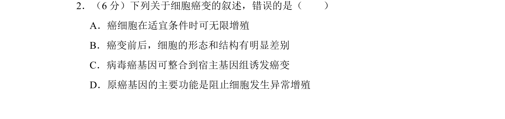
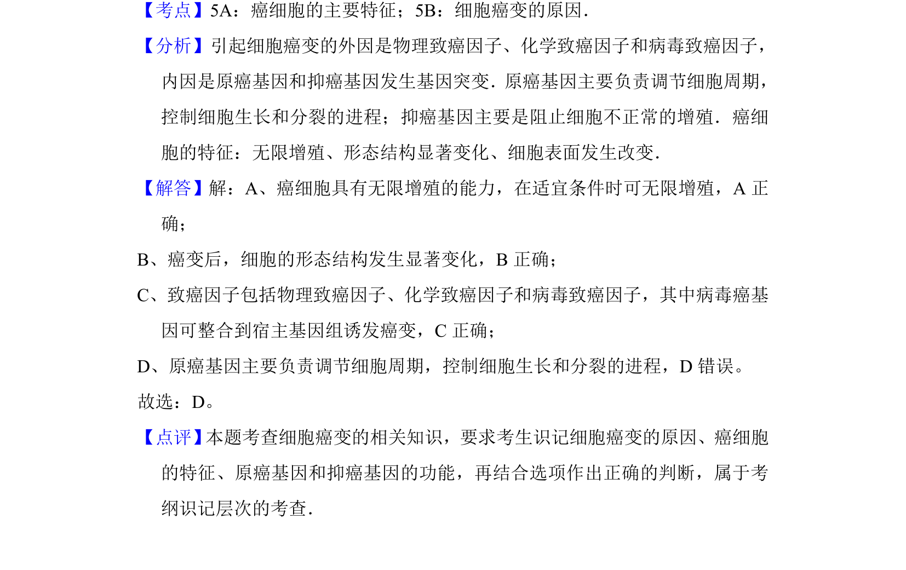

## 题面

## 摘要

本题考查癌细胞的特征及癌变原因，要求识记相关知识点并判断选项正误。

## 关联考点

- [[815-癌细胞特征|癌细胞特征]]
- [[797-细胞癌变原因|细胞癌变原因]]
- [[563-原癌基因功能|原癌基因功能]]

## 答案与解析

> 📄 原 PDF 第 2 页：`素材/真题/吉林/2008-2024·（吉林）生物高考真题/2012年高考生物试卷（新课标）（解析卷）.pdf`

<!-- 题干文本-start -->
## 题干文本
2．（6分）下列关于细胞癌变的叙述，错误的是（　　）
A．癌细胞在适宜条件时可无限增殖
B．癌变前后，细胞的形态和结构有明显差别
C．病毒癌基因可整合到宿主基因组诱发癌变
D．原癌基因的主要功能是阻止细胞发生异常增殖
<!-- 题干文本-end -->

<!-- 解析文本-start -->
## 解析文本
【考点】5A：癌细胞的主要特征；5B：细胞癌变的原因．菁优网版权所有
【分析】引起细胞癌变的外因是物理致癌因子、化学致癌因子和病毒致癌因子，
内因是原癌基因和抑癌基因发生基因突变．原癌基因主要负责调节细胞周期，
控制细胞生长和分裂的进程；抑癌基因主要是阻止细胞不正常的增殖．癌细
胞的特征：无限增殖、形态结构显著变化、细胞表面发生改变．
【解答】解：A、癌细胞具有无限增殖的能力，在适宜条件时可无限增殖，A正
确；
B、癌变后，细胞的形态结构发生显著变化，B正确；
C、致癌因子包括物理致癌因子、化学致癌因子和病毒致癌因子，其中病毒癌基
因可整合到宿主基因组诱发癌变，C正确；
D、原癌基因主要负责调节细胞周期，控制细胞生长和分裂的进程，D错误。
故选：D。
【点评】 本题考查细胞癌变的相关知识，要求考生识记细胞癌变的原因、癌细胞
的特征、原癌基因和抑癌基因的功能，再结合选项作出正确的判断，属于考
纲识记层次的考查．
<!-- 解析文本-end -->
