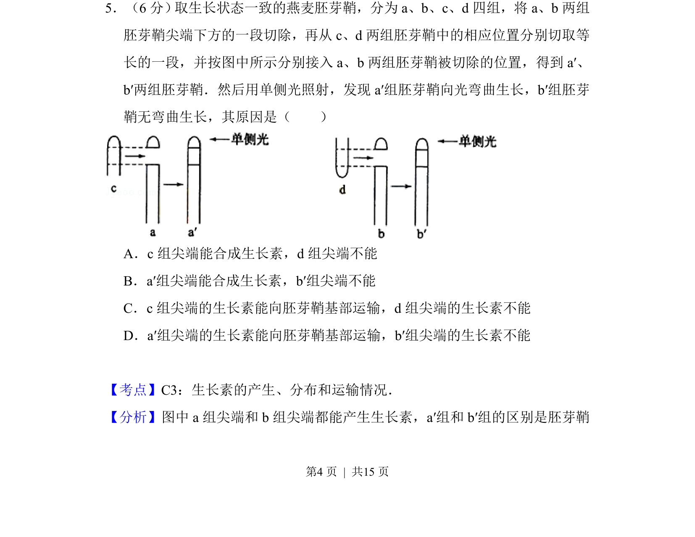
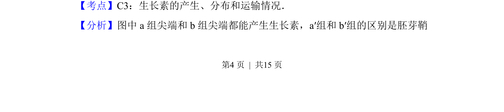
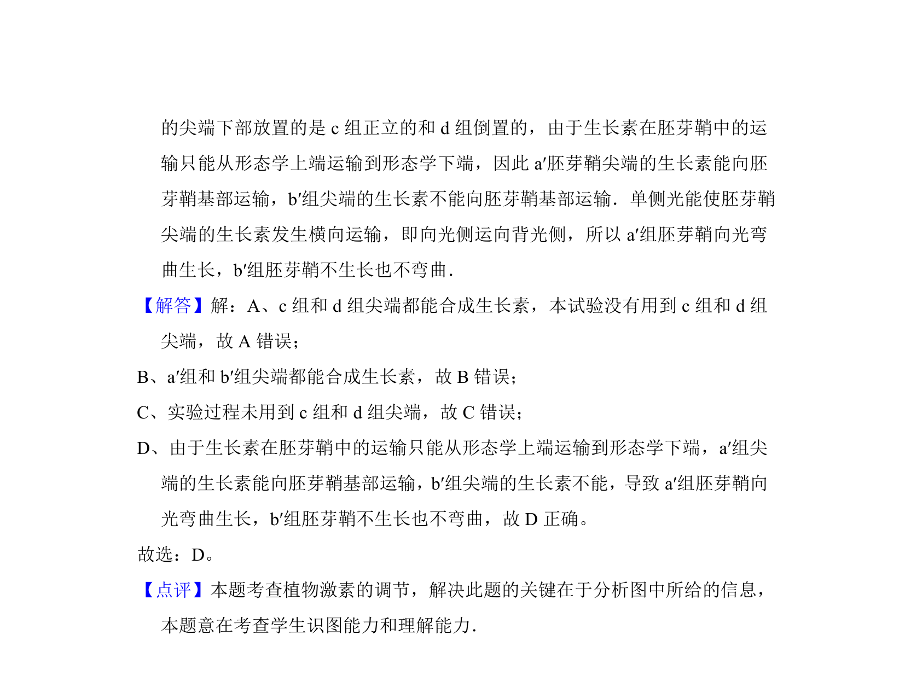

## 题面

## 摘要

本题考查生长素的产生部位和极性运输对植物向光性的影响，通过实验设计分析胚芽鞘弯曲生长的原因。

## 关联考点

- [[645-生长素的合成|生长素的合成]]
- [[646-生长素的极性运输|生长素的极性运输]]
- [[666-实验分析|实验分析]]

## 答案与解析

> 📄 原 PDF 第 4 页：`素材/真题/吉林/2008-2024·（吉林）生物高考真题/2012年高考生物试卷（新课标）（解析卷）.pdf`

<!-- 题干文本-start -->
## 题干文本
5．（6分） 取生长状态一致的燕麦胚芽鞘，分为a、b、c、d四组，将a、b两组
胚芽鞘尖端下方的一段切除，再从c、d两组胚芽鞘中的相应位置分别切取等
长的一段，并按图中所示分别接入a、b两组胚芽鞘被切除的位置，得到a′、
b′两组胚芽鞘．然后用单侧光照射，发现a′组胚芽鞘向光弯曲生长，b′组胚芽
鞘无弯曲生长，其原因是（　　）
A．c组尖端能合成生长素，d组尖端不能
B．a′组尖端能合成生长素，b′组尖端不能
C．c组尖端的生长素能向胚芽鞘基部运输，d组尖端的生长素不能
D．a′组尖端的生长素能向胚芽鞘基部运输，b′组尖端的生长素不能
<!-- 题干文本-end -->

<!-- 解析文本-start -->
## 解析文本
【考点】C3：生长素的产生、分布和运输情况．菁优网版权所有
【分析】图中a组尖端和b组尖端都能产生生长素，a′组和b′组的区别是胚芽鞘
<!-- 解析文本-end -->
