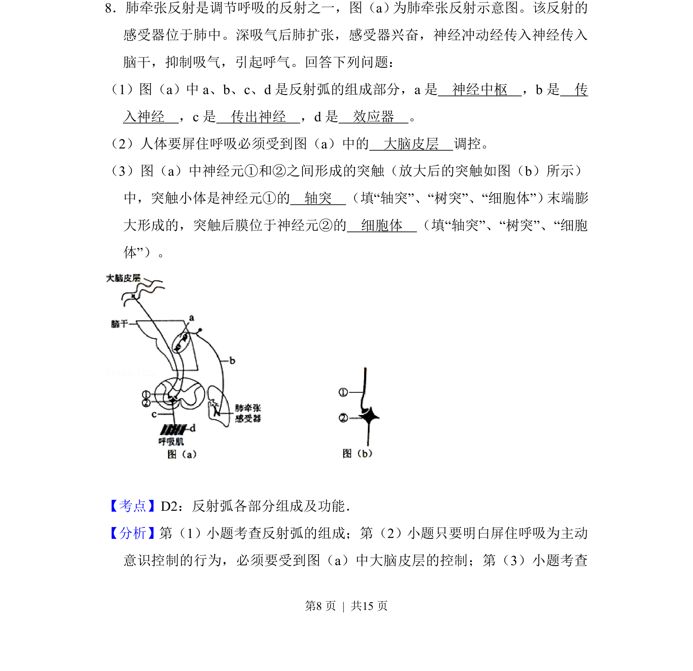
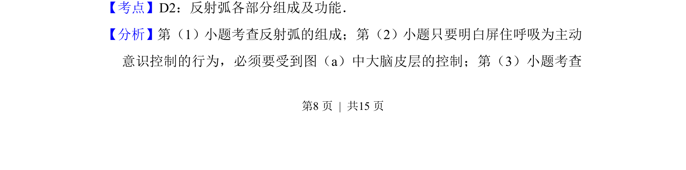
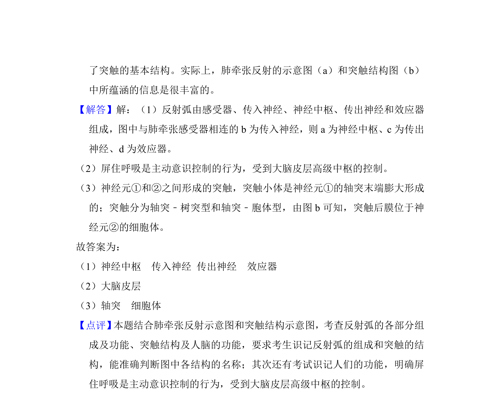

## 题面

## 摘要

该题考查反射弧的组成、大脑皮层对呼吸的调控及突触结构。

## 关联考点

- [[085-反射弧（初中）|反射弧]]
- [[326-突触|突触]]
- [[324-神经调节|神经调节]]

## 答案与解析

> 📄 原 PDF 第 8 页：`素材/真题/吉林/2008-2024·（吉林）生物高考真题/2012年高考生物试卷（新课标）（解析卷）.pdf`

<!-- 题干文本-start -->
## 题干文本
8．肺牵张反射是调节呼吸的反射之一，图（a） 为肺牵张反射示意图。该反射的
感受器位于肺中。深吸气后肺扩张，感受器兴奋，神经冲动经传入神经传入
脑干，抑制吸气，引起呼气。回答下列问题：
（1）图（a）中a、b、c、d是反射弧的组成部分，a是　神经中枢　，b是　传
入神经　，c是　传出神经　，d是　效应器　。
（2）人体要屏住呼吸必须受到图（a）中的　大脑皮层　调控。
（3）图（a）中神经元①和②之间形成的突触（放大后的突触如图（b）所示）
中，突触小体是神经元①的　轴突　（填“轴突”、“树突”、“细胞体”） 末端膨
大形成的，突触后膜位于神经元②的　细胞体　（填“轴突”、“树突”、“细胞
体”）。
<!-- 题干文本-end -->

<!-- 解析文本-start -->
## 解析文本
【考点】D2：反射弧各部分组成及功能．菁优网版权所有
【分析】第（1）小题考查反射弧的组成；第（2）小题只要明白屏住呼吸为主动
意识控制的行为，必须要受到图（a）中大脑皮层的控制；第（3）小题考查
<!-- 解析文本-end -->
