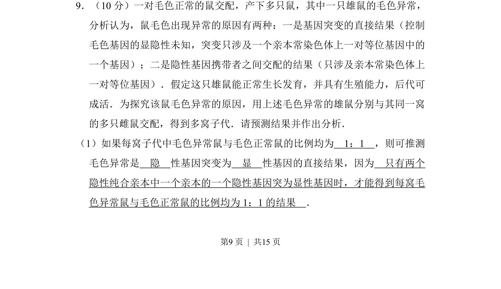
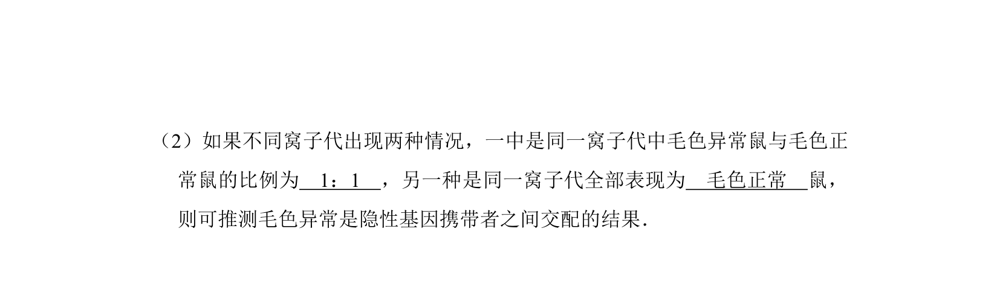
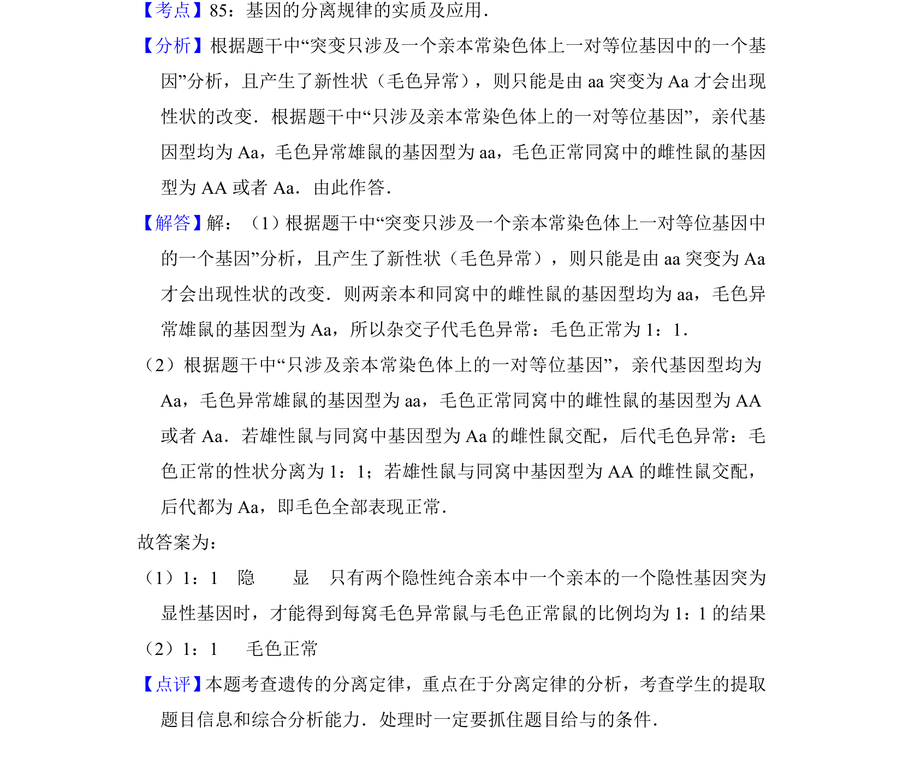

## 题面

## 摘要

本题考查基因突变与隐性基因携带者交配的遗传规律分析，需预测子代表现型比例并判断突变类型。

## 关联考点

- [[301-基因突变|基因突变]]
- [[609-显隐性分析|显隐性分析]]
- [[266-分离定律|分离定律]]
- [[718-遗传概率|遗传概率]]

## 答案与解析

> 📄 原 PDF 第 9 页：`素材/真题/吉林/2008-2024·（吉林）生物高考真题/2012年高考生物试卷（新课标）（解析卷）.pdf`

<!-- 题干文本-start -->
## 题干文本
9．（10分）一对毛色正常的鼠交配，产下多只鼠，其中一只雄鼠的毛色异常，
分析认为，鼠毛色出现异常的原因有两种：一是基因突变的直接结果（控制
毛色基因的显隐性未知，突变只涉及一个亲本常染色体上一对等位基因中的
一个基因）；二是隐性基因携带者之间交配的结果（只涉及亲本常染色体上
一对等位基因）．假定这只雄鼠能正常生长发育，并具有生殖能力，后代可
成活．为探究该鼠毛色异常的原因，用上述毛色异常的雄鼠分别与其同一窝
的多只雌鼠交配，得到多窝子代．请预测结果并作出分析．
（1）如果每窝子代中毛色异常鼠与毛色正常鼠的比例均为　1：1　，则可推测
毛色异常是　隐　性基因突变为　显　性基因的直接结果，因为　只有两个
隐性纯合亲本中一个亲本的一个隐性基因突为显性基因时，才能得到每窝毛
色异常鼠与毛色正常鼠的比例均为1：1的结果　．
<!-- 题干文本-end -->

<!-- 解析文本-start -->
## 解析文本

<!-- 解析文本-end -->
