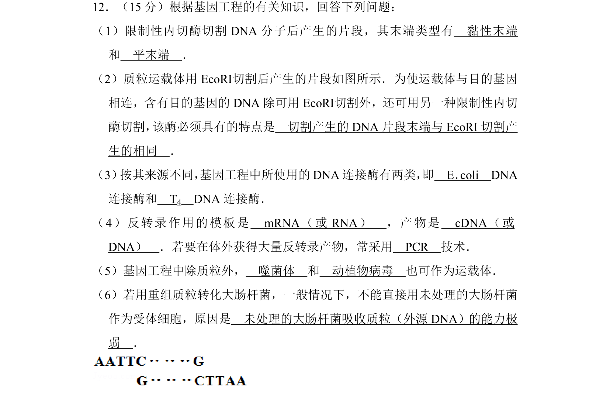
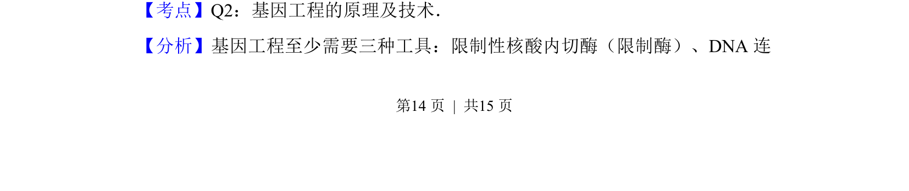
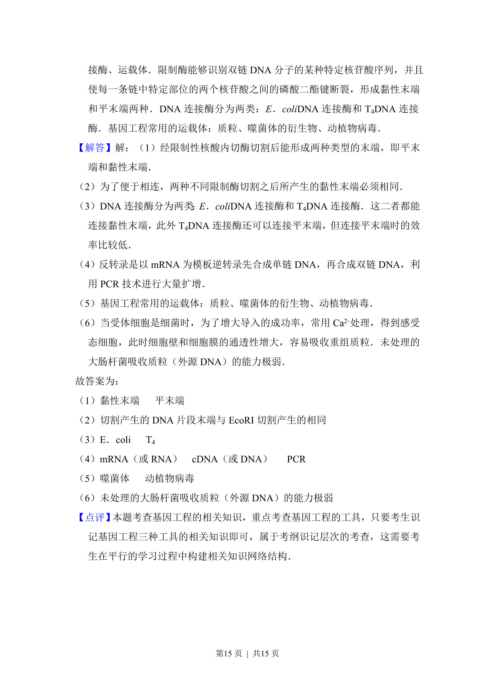

## 题面

## 摘要

本题考查基因工程工具、操作步骤及原理，包括限制酶、连接酶、载体和受体细胞等基础知识。

## 关联考点

- [[730-限制性内切酶|限制性内切酶]]
- [[409-DNA连接酶|DNA连接酶]]
- [[420-载体|基因工程载体]]
- [[565-反转录与PCR|反转录与PCR]]

## 答案与解析

> 📄 原 PDF 第 14 页：`素材/真题/吉林/2008-2024·（吉林）生物高考真题/2012年高考生物试卷（新课标）（解析卷）.pdf`
