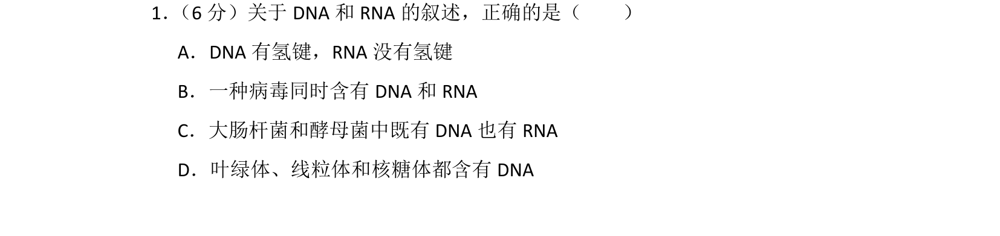
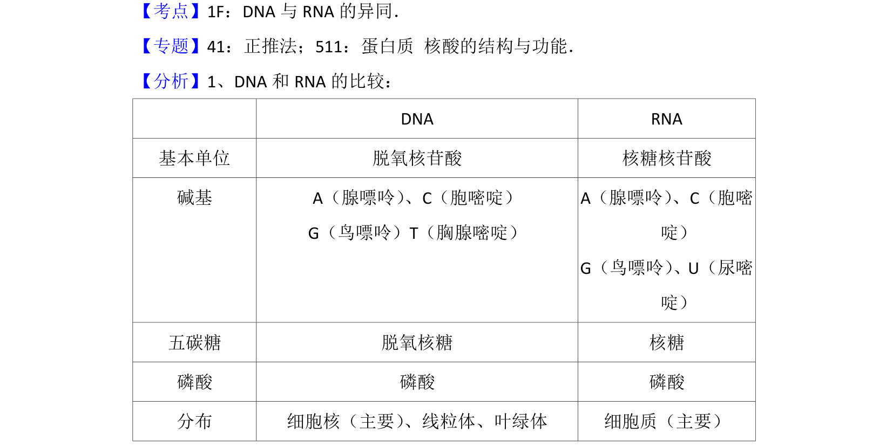

## 题面

## 摘要

本题通过选择题形式考查DNA与RNA在结构、分布及病毒遗传物质方面的异同。

## 关联考点

- [[461-DNA与RNA的异同|DNA与RNA的异同]]
- [[848-核酸的结构与功能|核酸结构与功能]]
- [[654-病毒遗传物质|病毒遗传物质]]

## 答案与解析

> 📄 原 PDF 第 1 页：`素材/真题/吉林/2008-2024·（吉林）生物高考真题/2013年高考生物试卷（新课标Ⅱ）（解析卷）.pdf`

<!-- 题干文本-start -->
## 题干文本
1． （6分）关于DNA和RNA的叙述，正确的是（　　）
A．DNA有氢键，RNA没有氢键
B．一种病毒同时含有DNA和RNA
C．大肠杆菌和酵母菌中既有DNA也有RNA
D．叶绿体、线粒体和核糖体都含有DNA
<!-- 题干文本-end -->

<!-- 解析文本-start -->
## 解析文本
【考点】1F：DNA与RNA的异同．菁优网版权所有
【专题】41：正推法；511：蛋白质 核酸的结构与功能．
【分析】1、DNA和RNA的比较：
 DNA RNA
基本单位 脱氧核苷酸 核糖核苷酸
碱基 A（腺嘌呤） 、C（胞嘧啶）
G（鸟嘌呤）T（胸腺嘧啶）
A（腺嘌呤） 、C（胞嘧
啶）
G（鸟嘌呤） 、U（尿嘧
啶）
五碳糖 脱氧核糖 核糖
磷酸 磷酸 磷酸
分布 细胞核（主要） 、线粒体、叶绿体 细胞质（主要）
<!-- 解析文本-end -->
