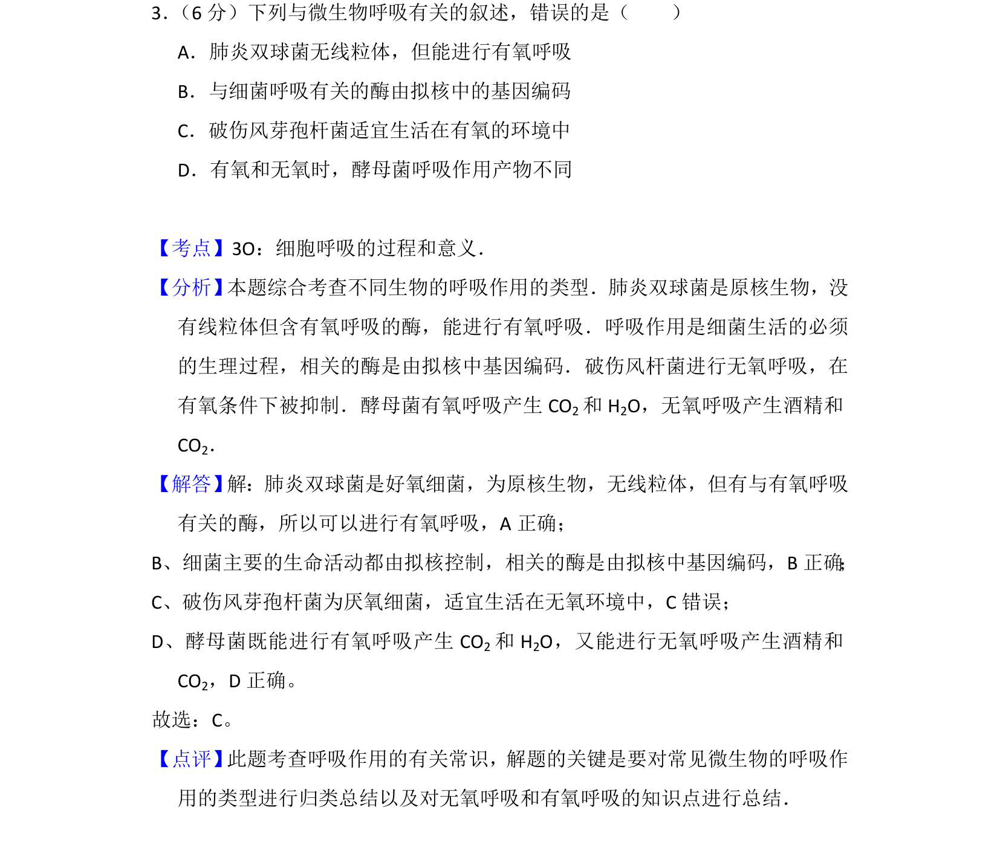

## 题面

## 摘要

考查微生物的呼吸作用类型及有氧无氧条件下的产物区别

## 关联考点

- [[241-细胞呼吸|细胞呼吸]]
- [[240-有氧呼吸|有氧呼吸]]
- [[238-无氧呼吸|无氧呼吸]]
- [[原核生物]]

## 答案与解析

> 📄 原 PDF 第 3 页：`素材/真题/吉林/2008-2024·（吉林）生物高考真题/2013年高考生物试卷（新课标Ⅱ）（解析卷）.pdf`
