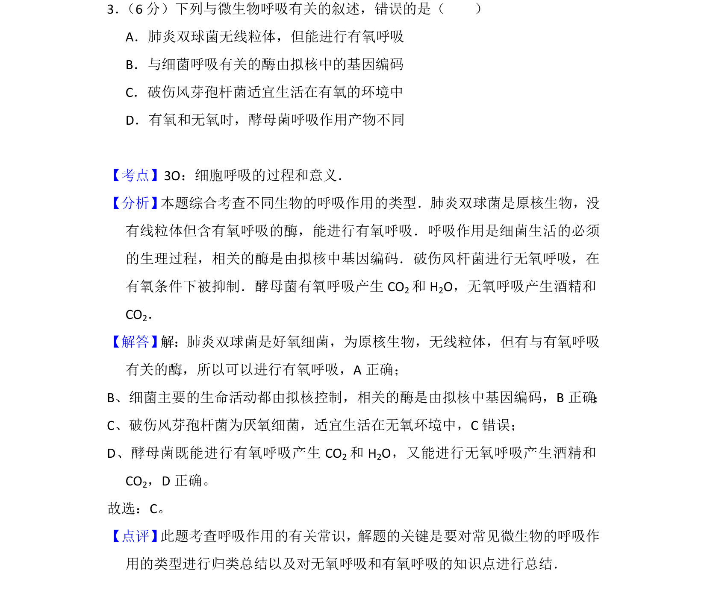
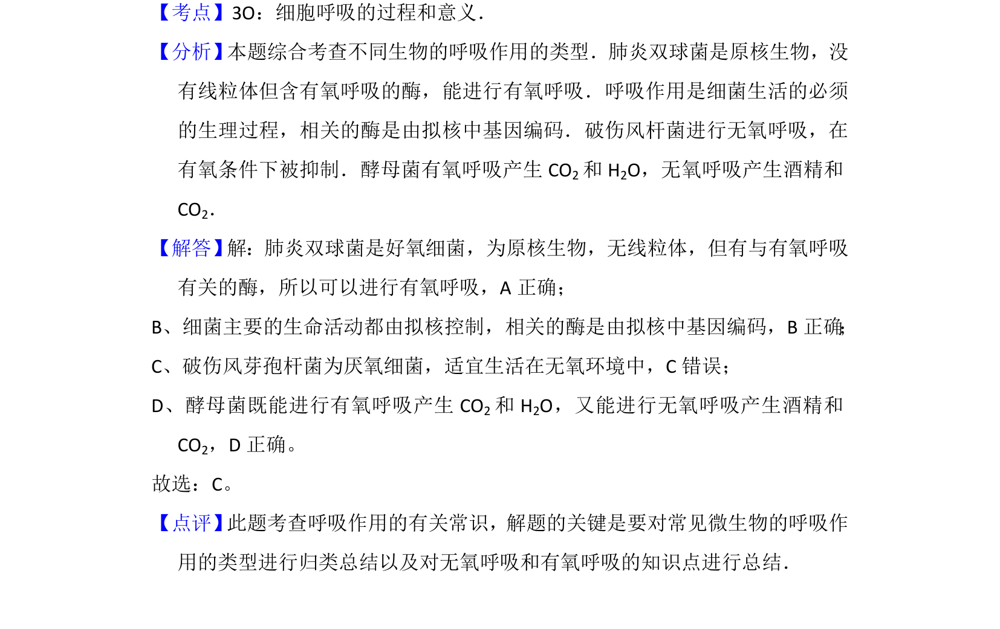

## 题面

## 摘要

考查微生物的呼吸作用类型及有氧无氧条件下的产物区别

## 关联考点

- [[241-细胞呼吸|细胞呼吸]]
- [[240-有氧呼吸|有氧呼吸]]
- [[238-无氧呼吸|无氧呼吸]]
- [[561-原核生物|原核生物]]

## 答案与解析

> 📄 原 PDF 第 3 页：`素材/真题/吉林/2008-2024·（吉林）生物高考真题/2013年高考生物试卷（新课标Ⅱ）（解析卷）.pdf`

<!-- 题干文本-start -->
## 题干文本
3． （6分）下列与微生物呼吸有关的叙述，错误的是（　　）
A．肺炎双球菌无线粒体，但能进行有氧呼吸
B．与细菌呼吸有关的酶由拟核中的基因编码
C．破伤风芽孢杆菌适宜生活在有氧的环境中
D．有氧和无氧时，酵母菌呼吸作用产物不同
<!-- 题干文本-end -->

<!-- 解析文本-start -->
## 解析文本
【考点】3O：细胞呼吸的过程和意义．菁优网版权所有
【分析】 本题综合考查不同生物的呼吸作用的类型．肺炎双球菌是原核生物，没
有线粒体但含有氧呼吸的酶，能进行有氧呼吸．呼吸作用是细菌生活的必须
的生理过程，相关的酶是由拟核中基因编码．破伤风杆菌进行无氧呼吸，在
有氧条件下被抑制．酵母菌有氧呼吸产生CO 2和H 2O，无氧呼吸产生酒精和
CO2．
【解答】 解：肺炎双球菌是好氧细菌，为原核生物，无线粒体，但有与有氧呼吸
有关的酶，所以可以进行有氧呼吸，A正确；
B、细菌主要的生命活动都由拟核控制，相关的酶是由拟核中基因编码，B正确；
C、破伤风芽孢杆菌为厌氧细菌，适宜生活在无氧环境中，C错误；
D、酵母菌既能进行有氧呼吸产生CO 2和H 2O，又能进行无氧呼吸产生酒精和
CO2，D正确。
故选：C。
【点评】 此题考查呼吸作用的有关常识，解题的关键是要对常见微生物的呼吸作
用的类型进行归类总结以及对无氧呼吸和有氧呼吸的知识点进行总结．
<!-- 解析文本-end -->
