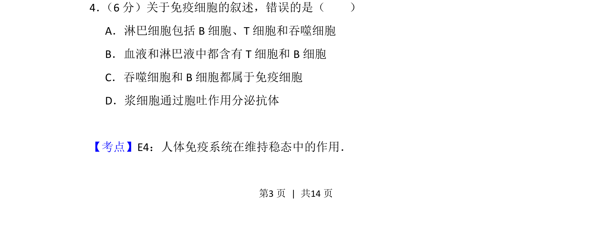
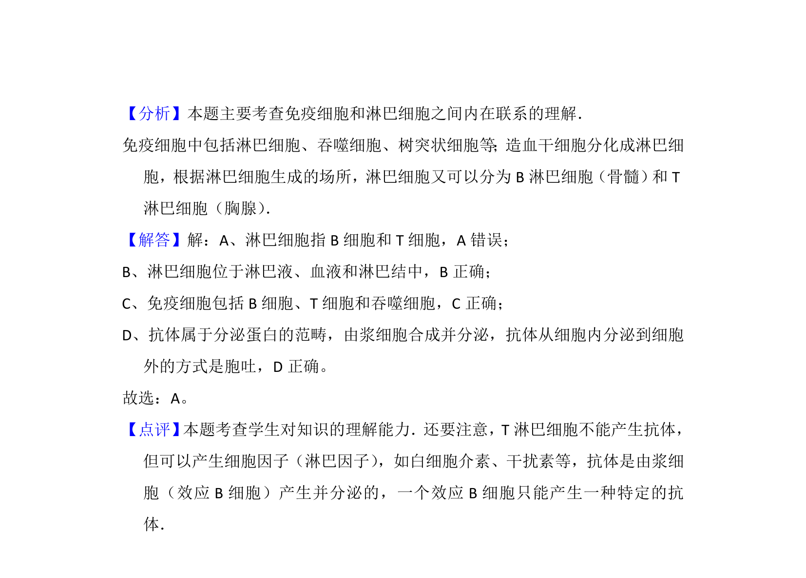

## 题面

## 摘要

本题考查免疫细胞的分类与功能，要求判断错误叙述。

## 关联考点

- [[355-免疫系统|免疫系统]]
- [[628-淋巴细胞|淋巴细胞]]
- [[475-吞噬细胞|吞噬细胞]]
- [[738-抗体分泌|抗体分泌]]

## 答案与解析

> 📄 原 PDF 第 3 页：`素材/真题/吉林/2008-2024·（吉林）生物高考真题/2013年高考生物试卷（新课标Ⅱ）（解析卷）.pdf`
