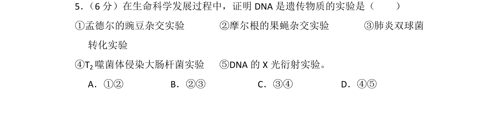
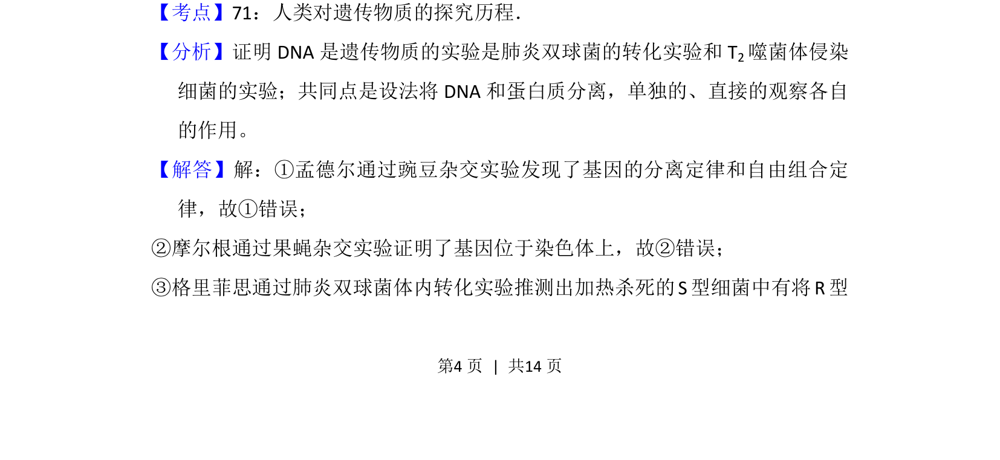
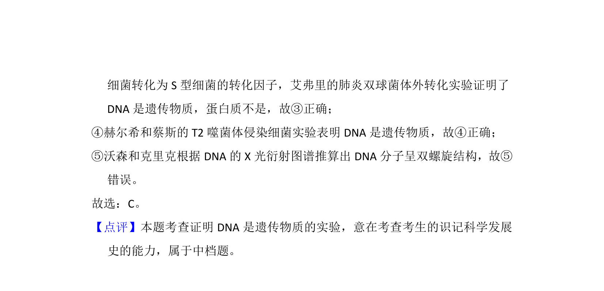

## 题面

## 摘要

该题考查证明DNA是遗传物质的关键实验。

## 关联考点

- [[720-遗传物质探究|遗传物质探究]]
- [[291-肺炎双球菌转化实验|肺炎双球菌转化实验]]
- [[816-噬菌体侵染实验|噬菌体侵染实验]]

## 答案与解析

> 📄 原 PDF 第 4 页：`素材/真题/吉林/2008-2024·（吉林）生物高考真题/2013年高考生物试卷（新课标Ⅱ）（解析卷）.pdf`

<!-- 题干文本-start -->
## 题干文本
5． （6分）在生命科学发展过程中，证明DNA是遗传物质的实验是（　　）
①孟德尔的豌豆杂交实验       ②摩尔根的果蝇杂交实验       ③肺炎双球菌
转化实验
④T2噬菌体侵染大肠杆菌实验   ⑤DNA的X光衍射实验。
A．①②B．②③C．③④D．④⑤
<!-- 题干文本-end -->

<!-- 解析文本-start -->
## 解析文本
【考点】71：人类对遗传物质的探究历程．菁优网版权所有
【分析】证明DNA是遗传物质的实验是肺炎双球菌的转化实验和T 2噬菌体侵染
细菌的实验；共同点是设法将DNA和蛋白质分离，单独的、直接的观察各自
的作用。
【解答】解：①孟德尔通过豌豆杂交实验发现了基因的分离定律和自由组合定
律，故①错误；
②摩尔根通过果蝇杂交实验证明了基因位于染色体上，故②错误；  
③格里菲思通过肺炎双球菌体内转化实验推测出加热杀死的S型细菌中有将R型
<!-- 解析文本-end -->
