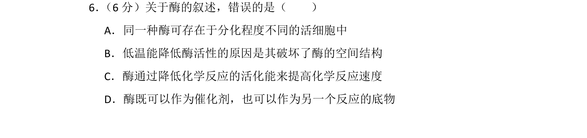
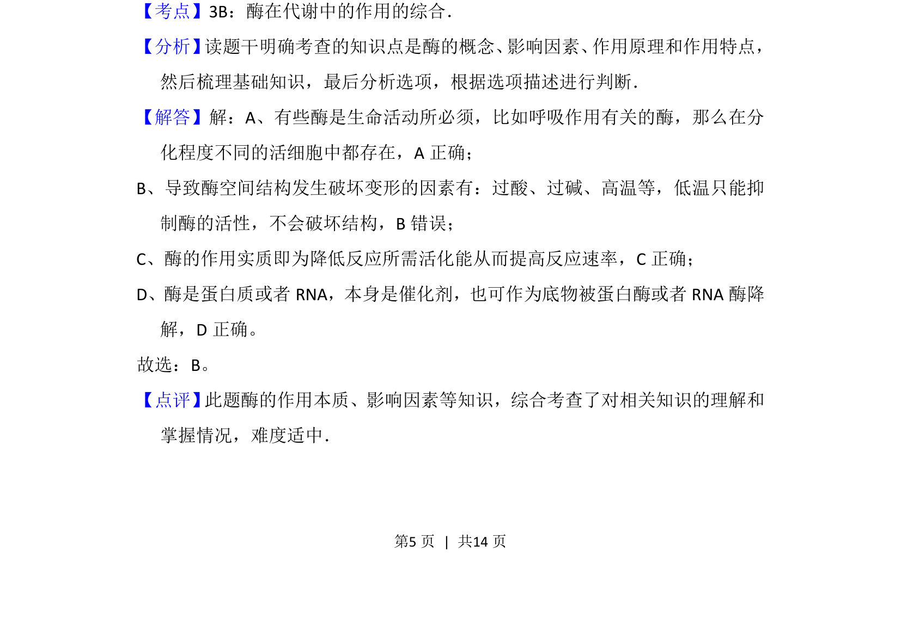

## 题面

## 摘要

本题通过辨析酶的特性，考查酶的存在、低温影响、作用机理及双重角色。

## 关联考点

- [[242-酶|酶]]
- [[351-活化能|活化能]]
- [[669-空间结构|空间结构]]
- [[039-催化剂|催化剂]]

## 答案与解析

> 📄 原 PDF 第 5 页：`素材/真题/吉林/2008-2024·（吉林）生物高考真题/2013年高考生物试卷（新课标Ⅱ）（解析卷）.pdf`
