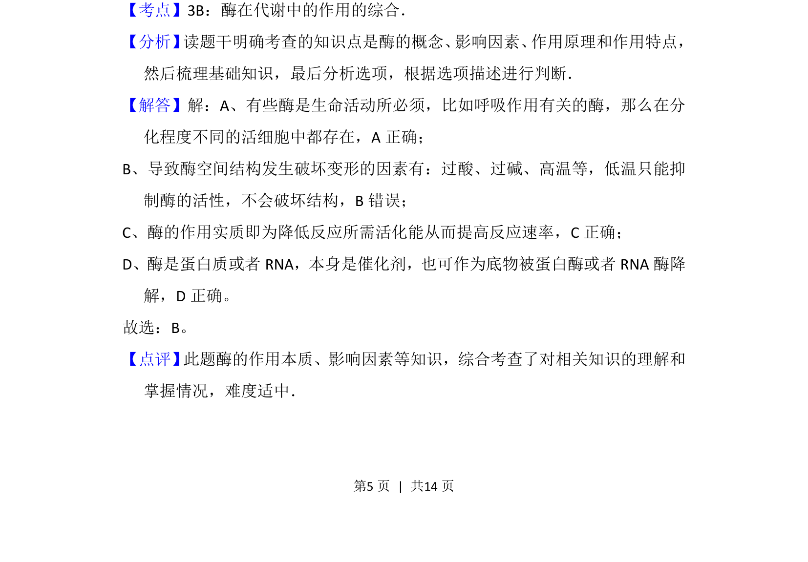

## 题面

## 摘要

本题通过辨析酶的特性，考查酶的存在、低温影响、作用机理及双重角色。

## 关联考点

- [[242-酶|酶]]
- [[351-活化能|活化能]]
- [[669-空间结构|空间结构]]
- [[039-催化剂|催化剂]]

## 答案与解析

> 📄 原 PDF 第 5 页：`素材/真题/吉林/2008-2024·（吉林）生物高考真题/2013年高考生物试卷（新课标Ⅱ）（解析卷）.pdf`

<!-- 题干文本-start -->
## 题干文本
6． （6分）关于酶的叙述，错误的是（　　）
A．同一种酶可存在于分化程度不同的活细胞中
B．低温能降低酶活性的原因是其破坏了酶的空间结构
C．酶通过降低化学反应的活化能来提高化学反应速度
D．酶既可以作为催化剂，也可以作为另一个反应的底物
<!-- 题干文本-end -->

<!-- 解析文本-start -->
## 解析文本
【考点】3B：酶在代谢中的作用的综合．菁优网版权所有
【分析】 读题干明确考查的知识点是酶的概念、 影响因素、 作用原理和作用特点，
然后梳理基础知识，最后分析选项，根据选项描述进行判断．
【解答】解：A、有些酶是生命活动所必须，比如呼吸作用有关的酶，那么在分
化程度不同的活细胞中都存在，A正确；
B、导致酶空间结构发生破坏变形的因素有：过酸、过碱、高温等，低温只能抑
制酶的活性，不会破坏结构，B错误；
C、酶的作用实质即为降低反应所需活化能从而提高反应速率，C正确；
D、酶是蛋白质或者RNA，本身是催化剂，也可作为底物被蛋白酶或者RNA酶降
解，D正确。
故选：B。
【点评】 此题酶的作用本质、影响因素等知识，综合考查了对相关知识的理解和
掌握情况，难度适中．
<!-- 解析文本-end -->
