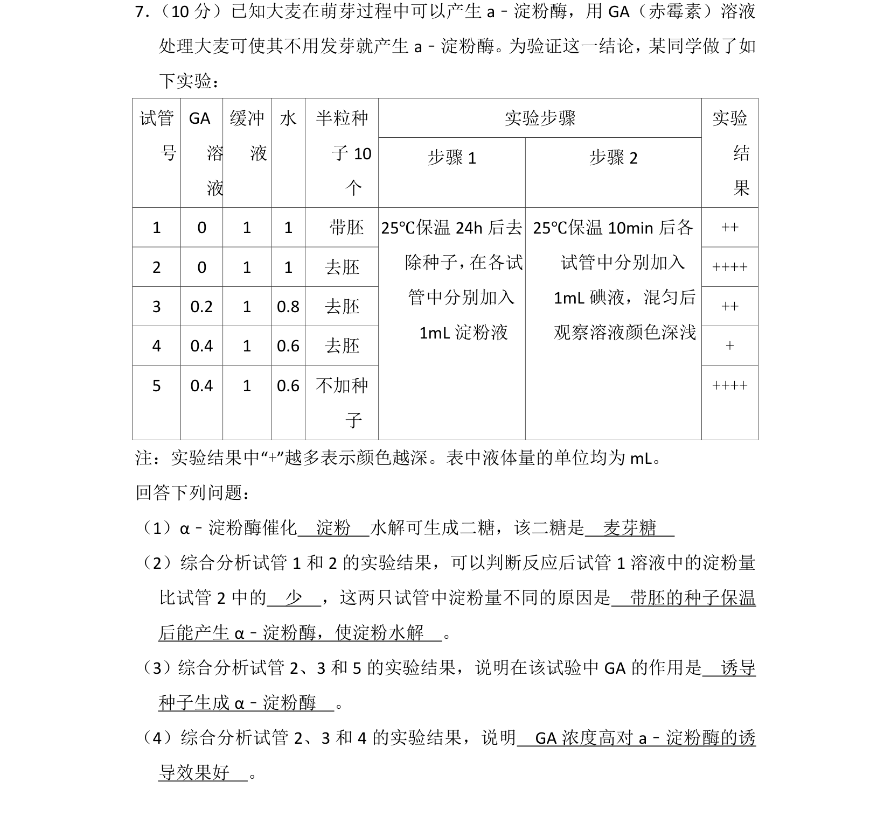
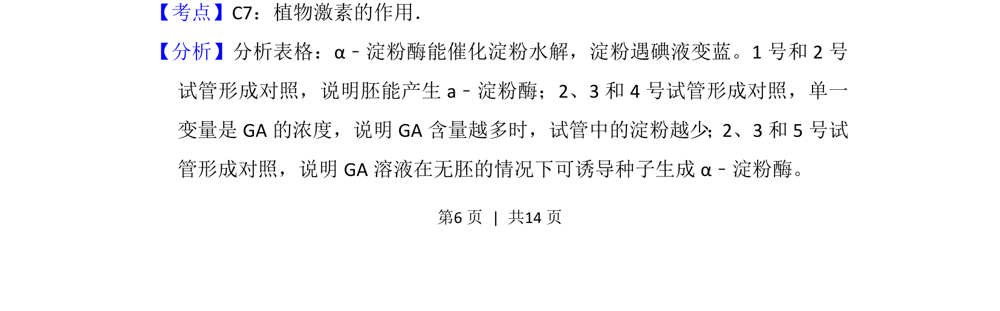
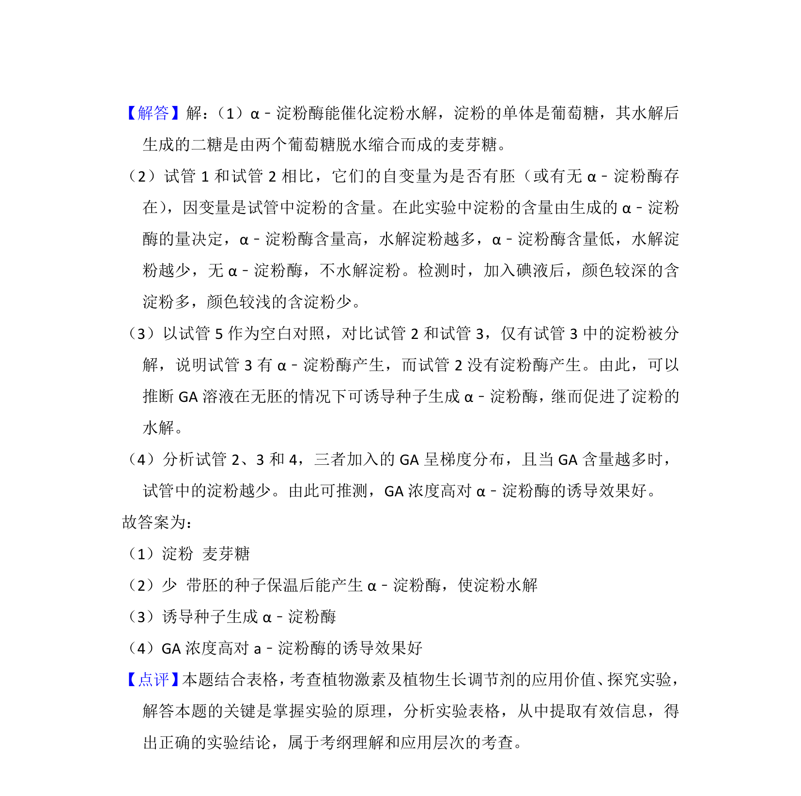

## 题面

## 摘要

验证赤霉素诱导大麦种子产生α-淀粉酶的实验分析

## 关联考点

- [[345-植物激素|植物激素]]
- [[351-赤霉素|赤霉素]]
- [[535-α-淀粉酶|α-淀粉酶]]
- [[485-对照实验|对照实验]]

## 答案与解析

> 📄 原 PDF 第 6 页：`素材/真题/吉林/2008-2024·（吉林）生物高考真题/2013年高考生物试卷（新课标Ⅱ）（解析卷）.pdf`

<!-- 题干文本-start -->
## 题干文本
7． （10分）已知大麦在萌芽过程中可以产生a﹣淀粉酶，用GA（赤霉素）溶液
处理大麦可使其不用发芽就产生a﹣淀粉酶。为验证这一结论，某同学做了如
下实验：
实验步骤试管
号
GA
溶
液
缓冲
液
水 半粒种
子10
个
步骤1 步骤2
实验
结
果
1 0 1 1  带胚 ++
2 0 1 1 去胚 ++++
3 0.2 1 0.8 去胚 ++
4 0.4 1 0.6 去胚 +
5 0.4 1 0.6 不加种
子
25℃保温24h后去
除种子， 在各试
管中分别加入
1mL淀粉液
25℃保温10min后各
试管中分别加入
1mL碘液，混匀后
观察溶液颜色深浅
++++
注：实验结果中“+”越多表示颜色越深。表中液体量的单位均为mL。
回答下列问题：
（1）α﹣淀粉酶催化　淀粉　水解可生成二糖，该二糖是　麦芽糖　
（2）综合分析试管1和2的实验结果，可以判断反应后试管1溶液中的淀粉量
比试管2中的　少　，这两只试管中淀粉量不同的原因是　带胚的种子保温
后能产生α﹣淀粉酶，使淀粉水解　。
（3）综合分析试管2、3和5的实验结果，说明在该试验中GA的作用是　诱导
种子生成α﹣淀粉酶　。
（4）综合分析试管2、3和4的实验结果，说明　GA浓度高对a﹣淀粉酶的诱
导效果好　。
<!-- 题干文本-end -->

<!-- 解析文本-start -->
## 解析文本
【考点】C7：植物激素的作用．菁优网版权所有
【分析】分析表格：α﹣淀粉酶能催化淀粉水解，淀粉遇碘液变蓝。1号和2号
试管形成对照，说明胚能产生a﹣淀粉酶；2、3和4号试管形成对照，单一
变量是GA的浓度，说明GA含量越多时，试管中的淀粉越少；2、3和5号试
管形成对照，说明GA溶液在无胚的情况下可诱导种子生成α﹣淀粉酶。
<!-- 解析文本-end -->
