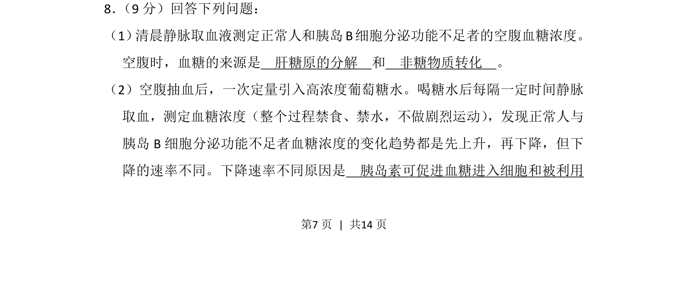
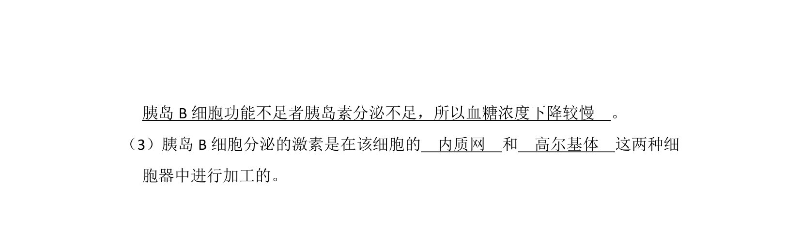
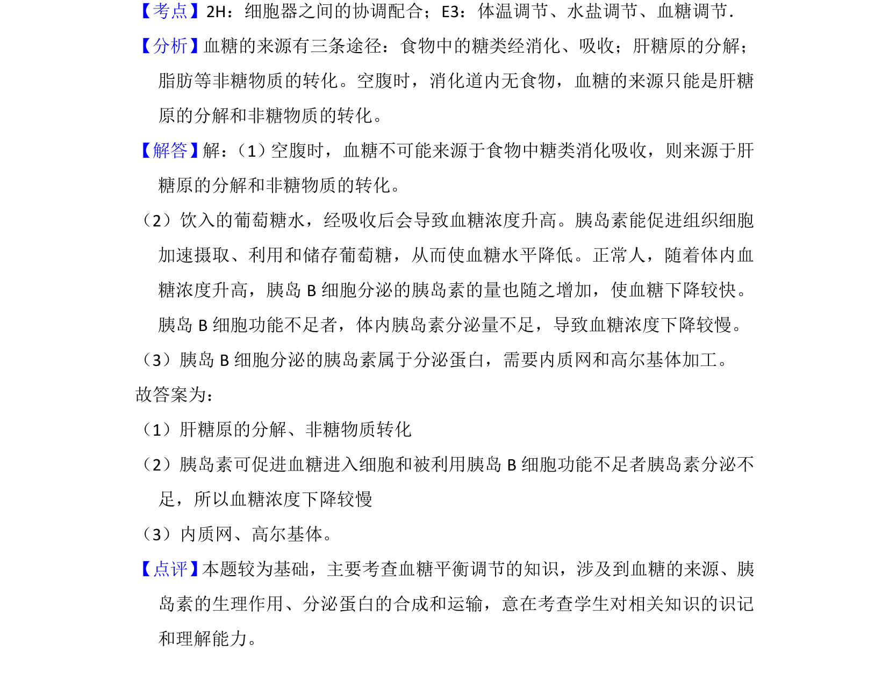

## 题面

## 摘要

考查空腹血糖来源及胰岛素对血糖浓度下降速率的影响。

## 关联考点

- [[702-血糖来源|血糖来源]]
- [[509-胰岛素功能|胰岛素功能]]
- [[512-血糖调节|血糖调节]]

## 答案与解析

> 📄 原 PDF 第 7 页：`素材/真题/吉林/2008-2024·（吉林）生物高考真题/2013年高考生物试卷（新课标Ⅱ）（解析卷）.pdf`
