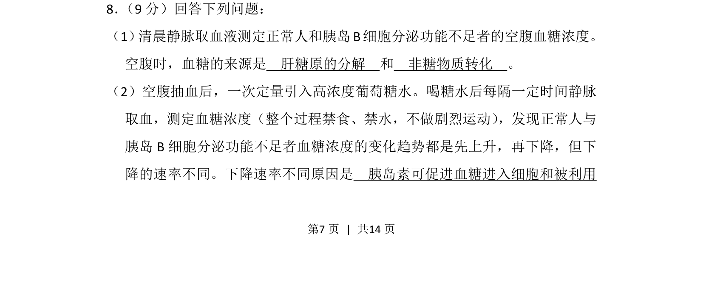
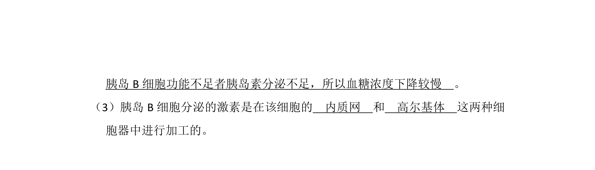
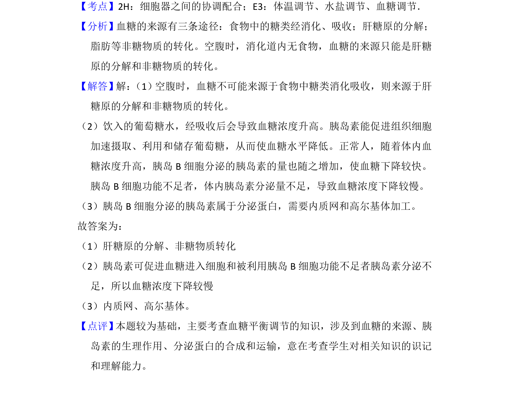

## 题面

## 摘要

考查空腹血糖来源及胰岛素对血糖浓度下降速率的影响。

## 关联考点

- [[702-血糖来源|血糖来源]]
- [[509-胰岛素功能|胰岛素功能]]
- [[512-血糖调节|血糖调节]]

## 答案与解析

> 📄 原 PDF 第 7 页：`素材/真题/吉林/2008-2024·（吉林）生物高考真题/2013年高考生物试卷（新课标Ⅱ）（解析卷）.pdf`

<!-- 题干文本-start -->
## 题干文本
8． （9分）回答下列问题：
（1） 清晨静脉取血液测定正常人和胰岛B细胞分泌功能不足者的空腹血糖浓度。
空腹时，血糖的来源是　肝糖原的分解　和　非糖物质转化　。
（2）空腹抽血后，一次定量引入高浓度葡萄糖水。喝糖水后每隔一定时间静脉
取血，测定血糖浓度（整个过程禁食、禁水，不做剧烈运动） ，发现正常人与
胰岛B细胞分泌功能不足者血糖浓度的变化趋势都是先上升，再下降，但下
降的速率不同。下降速率不同原因是　胰岛素可促进血糖进入细胞和被利用
<!-- 题干文本-end -->

<!-- 解析文本-start -->
## 解析文本

<!-- 解析文本-end -->
