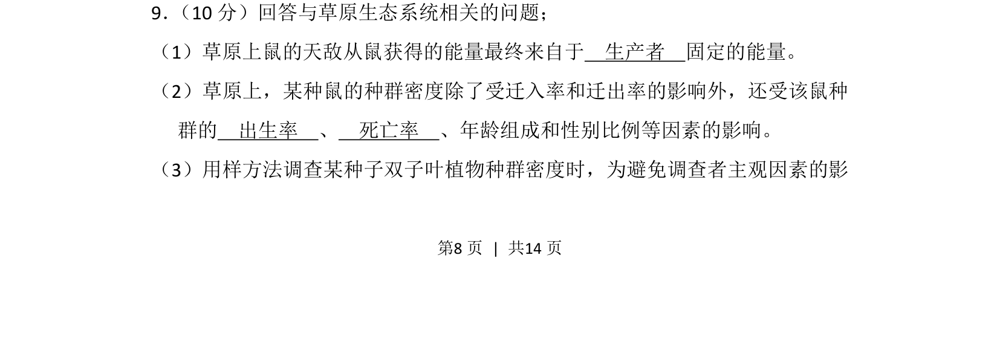
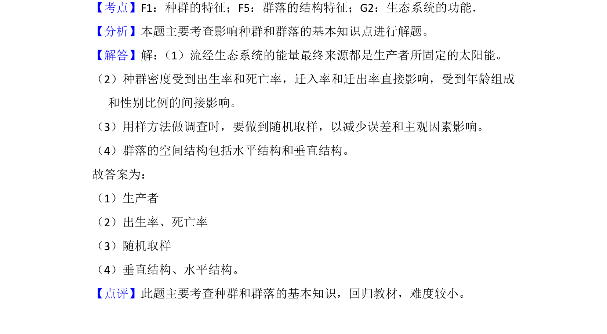

## 题面

## 摘要

该题考查草原生态系统能量来源、种群数量特征及样方法调查植物种群密度。

## 关联考点

- [[385-生态系统能量流动|生态系统能量流动]]
- [[882-种群的数量特征|种群数量特征]]
- [[366-样方法|样方法]]

## 答案与解析

> 📄 原 PDF 第 8 页：`素材/真题/吉林/2008-2024·（吉林）生物高考真题/2013年高考生物试卷（新课标Ⅱ）（解析卷）.pdf`

<!-- 题干文本-start -->
## 题干文本
9． （10分）回答与草原生态系统相关的问题；
（1）草原上鼠的天敌从鼠获得的能量最终来自于　生产者　固定的能量。
（2）草原上，某种鼠的种群密度除了受迁入率和迁出率的影响外，还受该鼠种
群的　出生率　、　死亡率　、年龄组成和性别比例等因素的影响。
（3）用样方法调查某种子双子叶植物种群密度时，为避免调查者主观因素的影
<!-- 题干文本-end -->

<!-- 解析文本-start -->
## 解析文本

<!-- 解析文本-end -->
