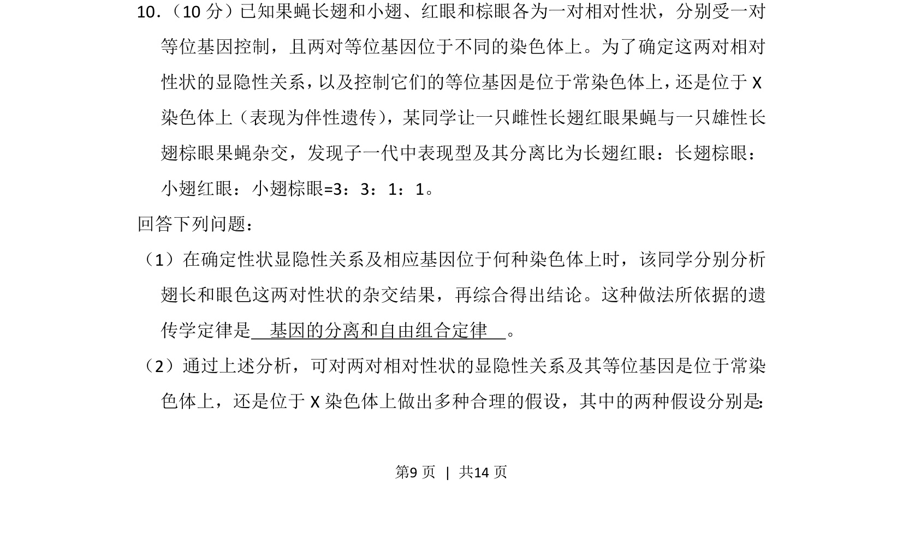

## 题面

## 摘要

这是一道遗传学综合题，要求学生运用基因分离和自由组合定律分析杂交实验结果并作出合理假设。

## 关联考点

- [[266-分离定律|基因的分离定律]]
- [[272-自由组合定律|基因的自由组合定律]]
- [[276-伴性遗传|伴性遗传]]
- [[显隐性判断]]

## 答案与解析

> 📄 原 PDF 第 9 页：`素材/真题/吉林/2008-2024·（吉林）生物高考真题/2013年高考生物试卷（新课标Ⅱ）（解析卷）.pdf`
