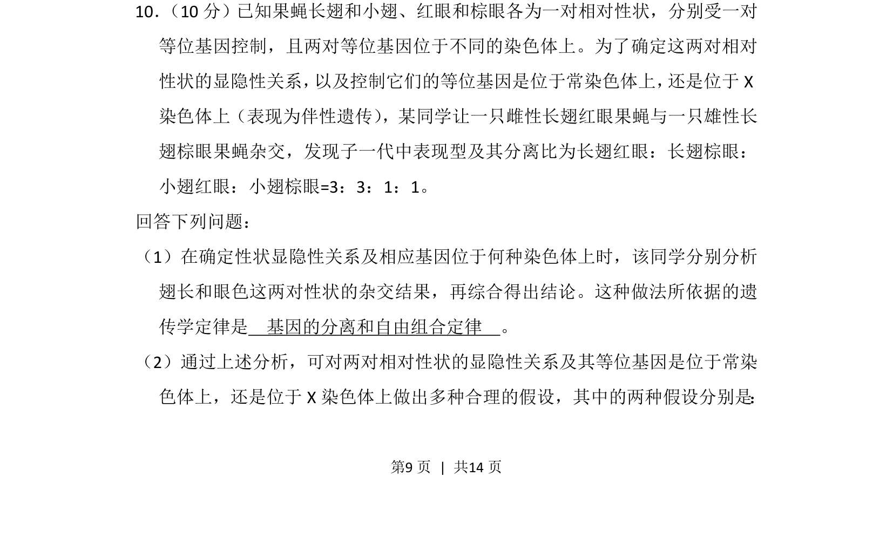
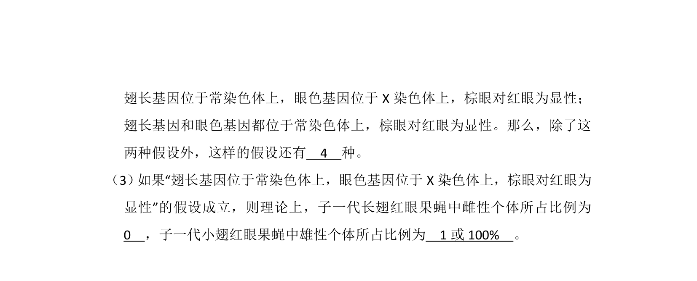
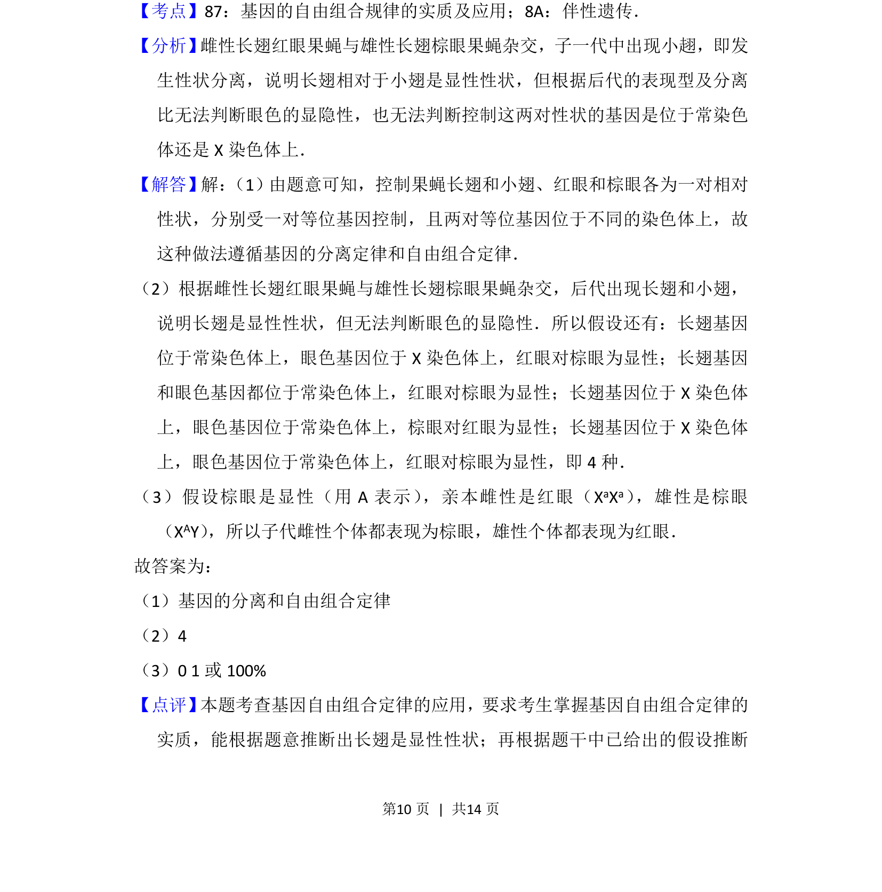

## 题面

## 摘要

这是一道遗传学综合题，要求学生运用基因分离和自由组合定律分析杂交实验结果并作出合理假设。

## 关联考点

- [[266-分离定律|基因的分离定律]]
- [[272-自由组合定律|基因的自由组合定律]]
- [[276-伴性遗传|伴性遗传]]
- [[610-显隐性判断|显隐性判断]]

## 答案与解析

> 📄 原 PDF 第 9 页：`素材/真题/吉林/2008-2024·（吉林）生物高考真题/2013年高考生物试卷（新课标Ⅱ）（解析卷）.pdf`

<!-- 题干文本-start -->
## 题干文本
10． （10分）已知果蝇长翅和小翅、红眼和棕眼各为一对相对性状，分别受一对
等位基因控制，且两对等位基因位于不同的染色体上。为了确定这两对相对
性状的显隐性关系， 以及控制它们的等位基因是位于常染色体上， 还是位于X
染色体上（表现为伴性遗传） ，某同学让一只雌性长翅红眼果蝇与一只雄性长
翅棕眼果蝇杂交，发现子一代中表现型及其分离比为长翅红眼：长翅棕眼：
小翅红眼：小翅棕眼=3：3：1：1。
回答下列问题：
（1）在确定性状显隐性关系及相应基因位于何种染色体上时，该同学分别分析
翅长和眼色这两对性状的杂交结果，再综合得出结论。这种做法所依据的遗
传学定律是　基因的分离和自由组合定律　。
（2）通过上述分析，可对两对相对性状的显隐性关系及其等位基因是位于常染
色体上，还是位于X染色体上做出多种合理的假设，其中的两种假设分别是：
<!-- 题干文本-end -->

<!-- 解析文本-start -->
## 解析文本

<!-- 解析文本-end -->
