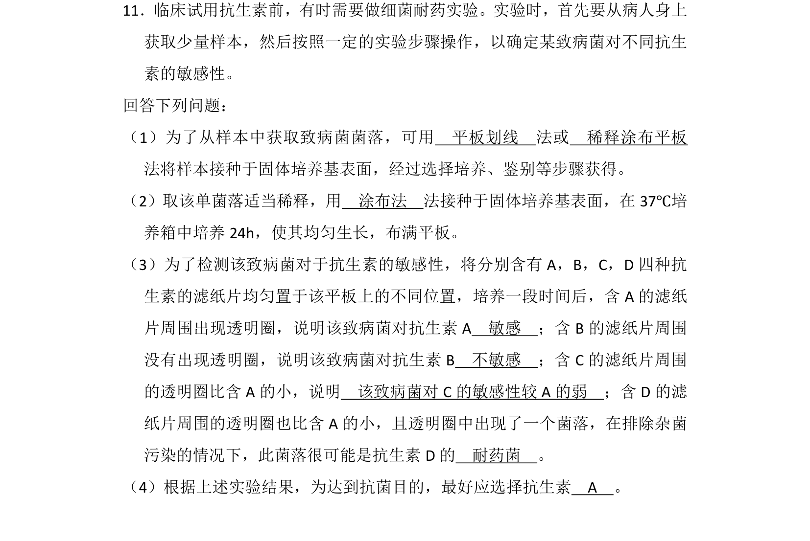
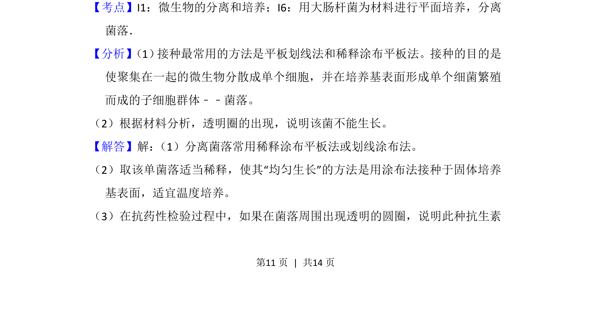
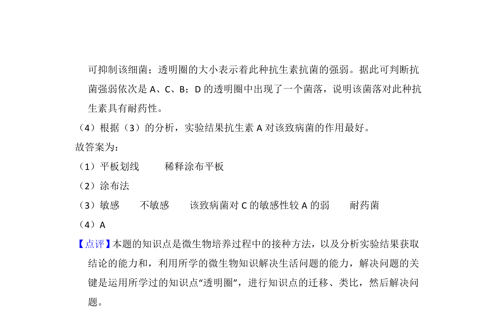

## 题面

## 摘要

该题考查微生物分离培养、接种方法及抗生素敏感性实验的结果分析。

## 关联考点

- [[599-微生物的分离和培养|微生物的分离和培养]]
- [[754-接种方法|接种方法]]
- [[756-抗生素敏感性实验|抗生素敏感性实验]]

## 答案与解析

> 📄 原 PDF 第 11 页：`素材/真题/吉林/2008-2024·（吉林）生物高考真题/2013年高考生物试卷（新课标Ⅱ）（解析卷）.pdf`

<!-- 题干文本-start -->
## 题干文本
11．临床试用抗生素前，有时需要做细菌耐药实验。实验时，首先要从病人身上
获取少量样本，然后按照一定的实验步骤操作，以确定某致病菌对不同抗生
素的敏感性。
回答下列问题：
（1）为了从样本中获取致病菌菌落，可用　平板划线　法或　稀释涂布平板　
法将样本接种于固体培养基表面，经过选择培养、鉴别等步骤获得。
（2）取该单菌落适当稀释，用　涂布法　法接种于固体培养基表面，在37℃培
养箱中培养24h，使其均匀生长，布满平板。
（3）为了检测该致病菌对于抗生素的敏感性，将分别含有A，B，C，D四种抗
生素的滤纸片均匀置于该平板上的不同位置，培养一段时间后，含A的滤纸
片周围出现透明圈，说明该致病菌对抗生素A　敏感　；含B的滤纸片周围
没有出现透明圈，说明该致病菌对抗生素B　不敏感　；含C的滤纸片周围
的透明圈比含A的小，说明　该致病菌对C的敏感性较A的弱　；含D的滤
纸片周围的透明圈也比含A的小，且透明圈中出现了一个菌落，在排除杂菌
污染的情况下，此菌落很可能是抗生素D的　耐药菌　。
（4）根据上述实验结果，为达到抗菌目的，最好应选择抗生素　A　。
<!-- 题干文本-end -->

<!-- 解析文本-start -->
## 解析文本
【考点】I1：微生物的分离和培养；I6：用大肠杆菌为材料进行平面培养，分离
菌落．菁优网版权所有
【分析】 （1） 接种最常用的方法是平板划线法和稀释涂布平板法。接种的目的是
使聚集在一起的微生物分散成单个细胞，并在培养基表面形成单个细菌繁殖
而成的子细胞群体﹣﹣菌落。
（2）根据材料分析，透明圈的出现，说明该菌不能生长。
【解答】解： （1）分离菌落常用稀释涂布平板法或划线涂布法。
（2）取该单菌落适当稀释，使其“均匀生长”的方法是用涂布法接种于固体培养
基表面，适宜温度培养。
（3）在抗药性检验过程中，如果在菌落周围出现透明的圆圈，说明此种抗生素
<!-- 解析文本-end -->
