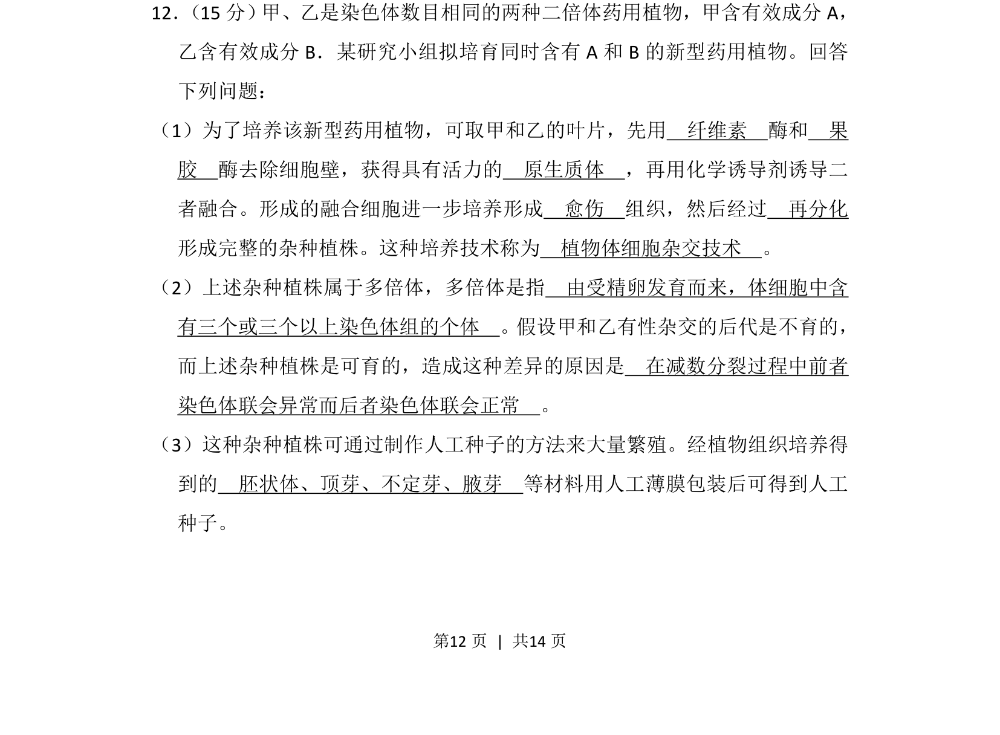
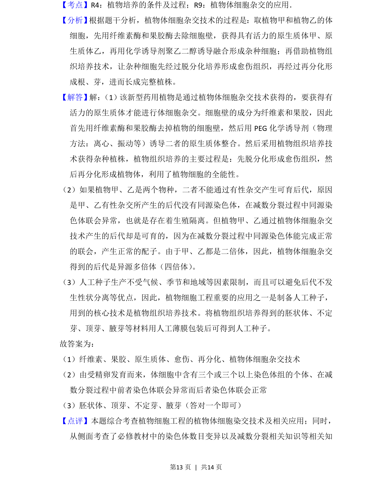
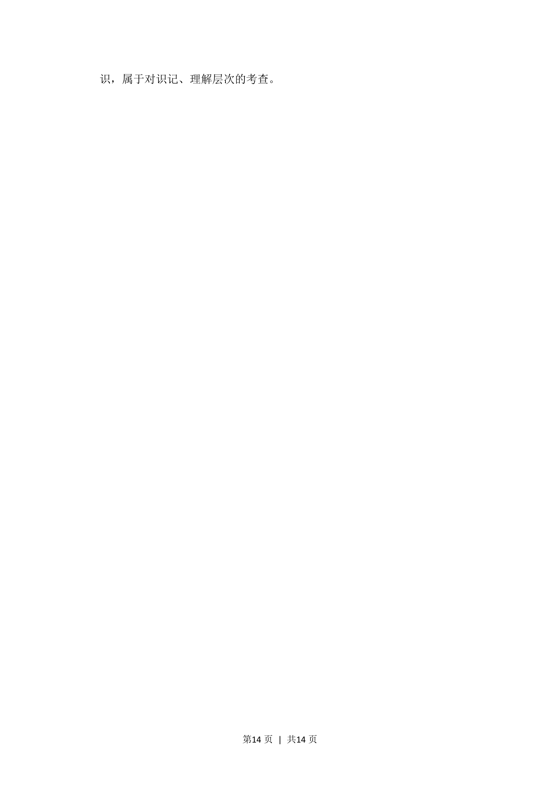

## 题面

## 摘要

本题为生物选做题，考查植物体细胞杂交技术、多倍体概念及人工种子制备。

## 关联考点

- [[436-植物体细胞杂交|植物体细胞杂交]]
- [[303-多倍体|多倍体]]
- [[466-人工种子|人工种子]]

## 答案与解析

> 📄 原 PDF 第 12 页：`素材/真题/吉林/2008-2024·（吉林）生物高考真题/2013年高考生物试卷（新课标Ⅱ）（解析卷）.pdf`
