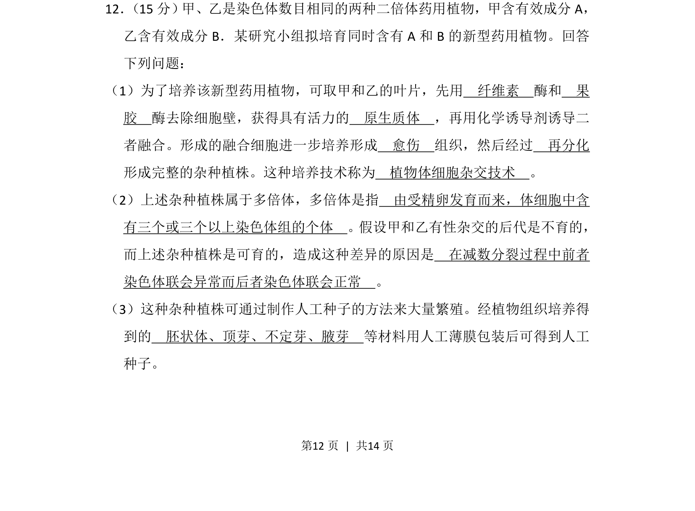
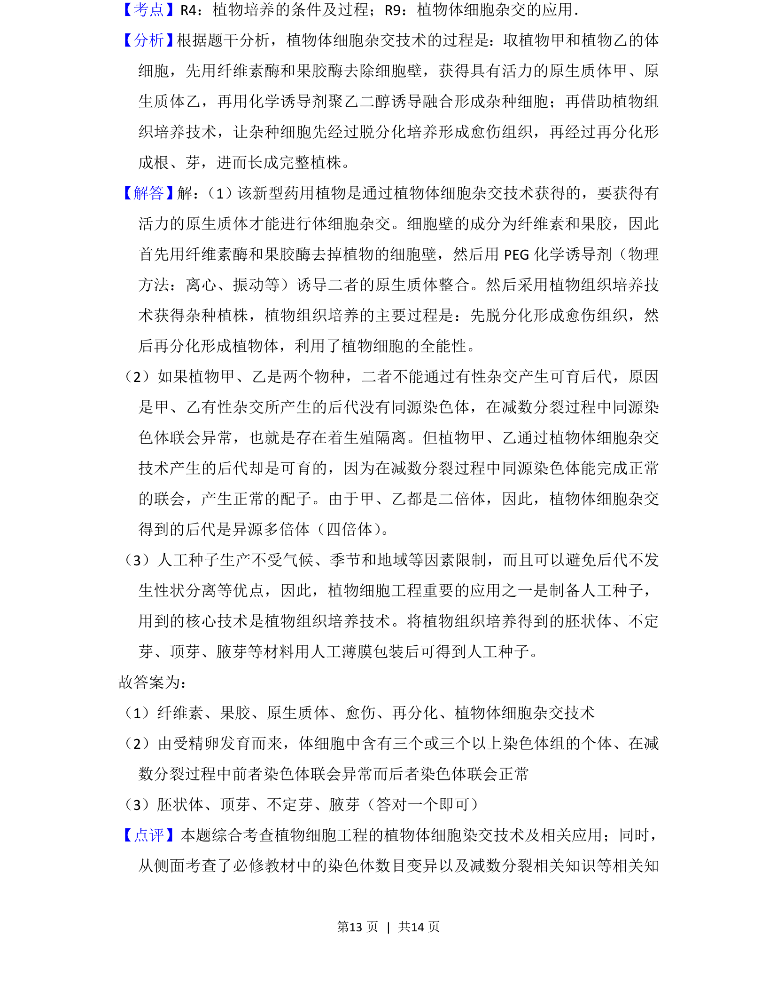

## 题面

## 摘要

本题为生物选做题，考查植物体细胞杂交技术、多倍体概念及人工种子制备。

## 关联考点

- [[436-植物体细胞杂交|植物体细胞杂交]]
- [[303-多倍体|多倍体]]
- [[466-人工种子|人工种子]]

## 答案与解析

> 📄 原 PDF 第 12 页：`素材/真题/吉林/2008-2024·（吉林）生物高考真题/2013年高考生物试卷（新课标Ⅱ）（解析卷）.pdf`

<!-- 题干文本-start -->
## 题干文本
12． （15分） 甲、乙是染色体数目相同的两种二倍体药用植物，甲含有效成分A，
乙含有效成分B．某研究小组拟培育同时含有A和B的新型药用植物。回答
下列问题：
（1）为了培养该新型药用植物，可取甲和乙的叶片，先用　纤维素　酶和　果
胶　酶去除细胞壁，获得具有活力的　原生质体　，再用化学诱导剂诱导二
者融合。形成的融合细胞进一步培养形成　愈伤　组织，然后经过　再分化　
形成完整的杂种植株。这种培养技术称为　植物体细胞杂交技术　。
（2）上述杂种植株属于多倍体，多倍体是指　由受精卵发育而来，体细胞中含
有三个或三个以上染色体组的个体　。假设甲和乙有性杂交的后代是不育的，
而上述杂种植株是可育的，造成这种差异的原因是　在减数分裂过程中前者
染色体联会异常而后者染色体联会正常　。
（3）这种杂种植株可通过制作人工种子的方法来大量繁殖。经植物组织培养得
到的　胚状体、顶芽、不定芽、腋芽　等材料用人工薄膜包装后可得到人工
种子。
<!-- 题干文本-end -->

<!-- 解析文本-start -->
## 解析文本

<!-- 解析文本-end -->
