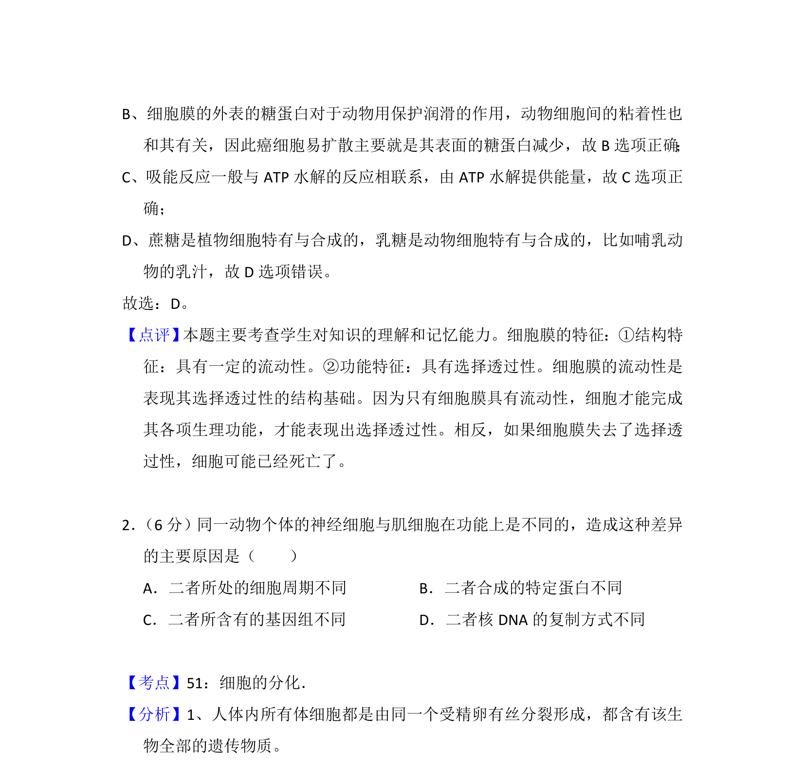

## 题面

## 摘要

本题主要考查细胞结构与功能，包括胞间连丝运输、细胞黏着、ATP供能与动物细胞糖类合成等知识。

## 关联考点

- [[044-细胞膜|细胞膜]]
- [[674-糖蛋白|糖蛋白]]
- [[234-ATP|ATP]]
- [[290-吸热反应|吸能反应]]

## 答案与解析

> 📄 原 PDF 第 1 页：`素材/真题/吉林/2008-2024·（吉林）生物高考真题/2014年高考生物试卷（新课标Ⅱ）（解析卷）.pdf`
