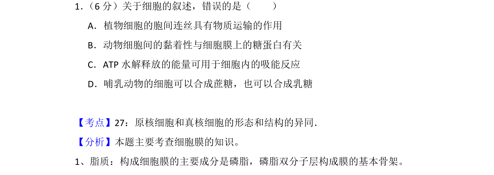
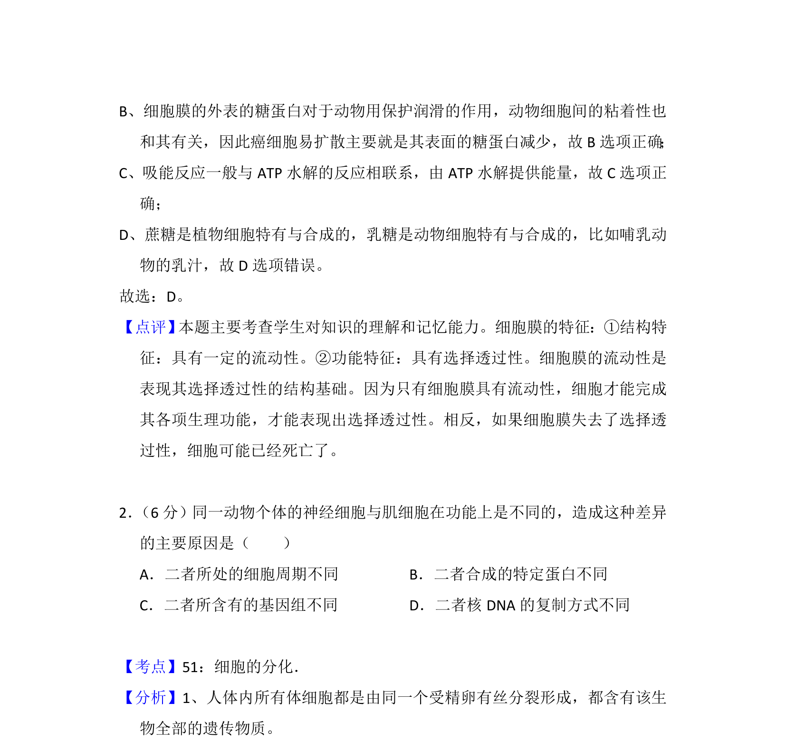

## 题面

## 摘要

本题主要考查细胞结构与功能，包括胞间连丝运输、细胞黏着、ATP供能与动物细胞糖类合成等知识。

## 关联考点

- [[044-细胞膜|细胞膜]]
- [[674-糖蛋白|糖蛋白]]
- [[234-ATP|ATP]]
- [[290-吸热反应|吸能反应]]

## 答案与解析

> 📄 原 PDF 第 1 页：`素材/真题/吉林/2008-2024·（吉林）生物高考真题/2014年高考生物试卷（新课标Ⅱ）（解析卷）.pdf`

<!-- 题干文本-start -->
## 题干文本
1． （6分）关于细胞的叙述，错误的是（　　）
A．植物细胞的胞间连丝具有物质运输的作用
B．动物细胞间的黏着性与细胞膜上的糖蛋白有关
C．ATP水解释放的能量可用于细胞内的吸能反应
D．哺乳动物的细胞可以合成蔗糖，也可以合成乳糖
<!-- 题干文本-end -->

<!-- 解析文本-start -->
## 解析文本
【考点】27：原核细胞和真核细胞的形态和结构的异同．菁优网版权所有
【分析】本题主要考查细胞膜的知识。
1、脂质：构成细胞膜的主要成分是磷脂，磷脂双分子层构成膜的基本骨架。
<!-- 解析文本-end -->
