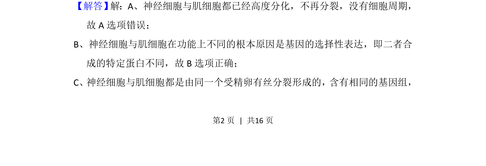
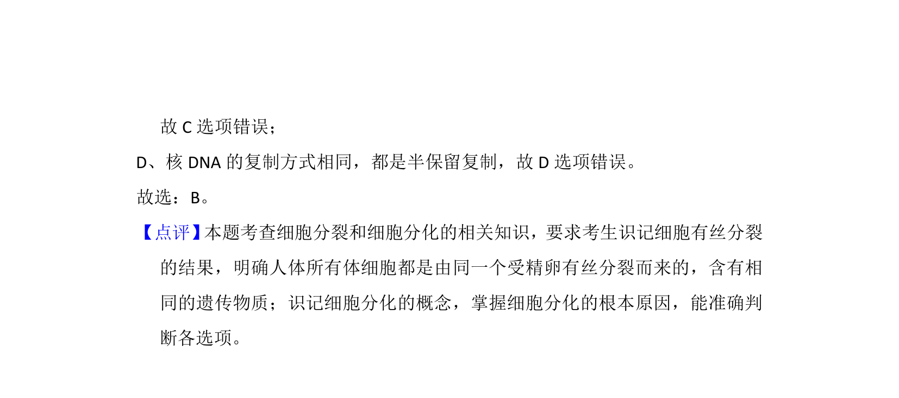

## 题面

## 摘要

本题考查细胞膜上蛋白质的位置及功能，包含糖被识别、载体运输及酶的催化作用。

## 关联考点

- [[044-细胞膜|细胞膜]]
- [[696-蛋白质功能|蛋白质功能]]
- [[800-糖被|糖被]]
- [[256-主动运输|主动运输]]

## 答案与解析

> 📄 原 PDF 第 2 页：`素材/真题/吉林/2008-2024·（吉林）生物高考真题/2014年高考生物试卷（新课标Ⅱ）（解析卷）.pdf`
