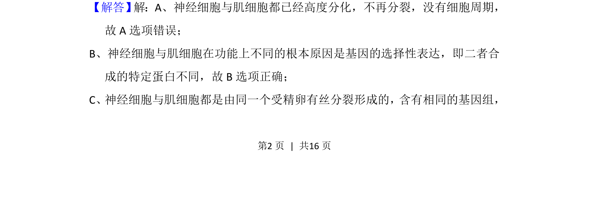
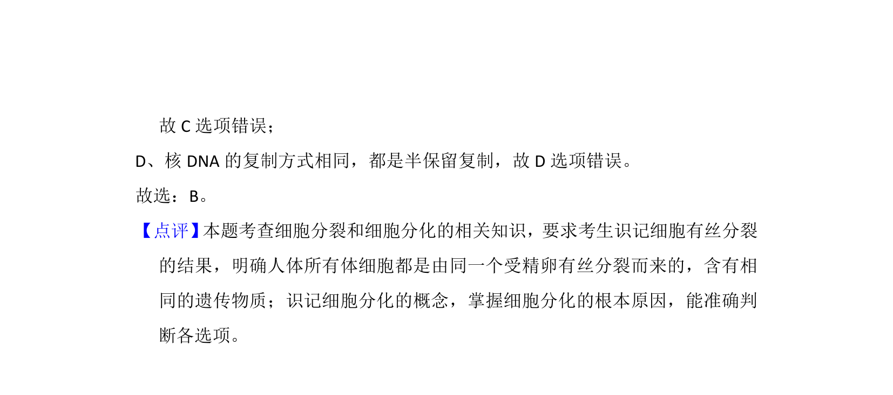

## 题面

## 摘要

本题考查细胞膜上蛋白质的位置及功能，包含糖被识别、载体运输及酶的催化作用。

## 关联考点

- [[044-细胞膜|细胞膜]]
- [[696-蛋白质功能|蛋白质功能]]
- [[800-糖被|糖被]]
- [[256-主动运输|主动运输]]

## 答案与解析

> 📄 原 PDF 第 2 页：`素材/真题/吉林/2008-2024·（吉林）生物高考真题/2014年高考生物试卷（新课标Ⅱ）（解析卷）.pdf`

<!-- 题干文本-start -->
## 题干文本
2． （6分）同一动物个体的神经细胞与肌细胞在功能上是不同的，造成这种差异
的主要原因是（　　）
A．二者所处的细胞周期不同B．二者合成的特定蛋白不同
C．二者所含有的基因组不同D．二者核DNA的复制方式不同
<!-- 题干文本-end -->

<!-- 解析文本-start -->
## 解析文本
【考点】51：细胞的分化．菁优网版权所有
【分析】1、人体内所有体细胞都是由同一个受精卵有丝分裂形成，都含有该生
物全部的遗传物质。
2、细胞分化是指在个体发育中，由一个或一种细胞增殖产生的后代，在形态，
结构和生理功能上发生稳定性差异的过程。细胞分化的实质是基因的选择性
表达，即不同细胞选择表达的基因不完全相同。
【解答】 解：A、神经细胞与肌细胞都已经高度分化，不再分裂，没有细胞周期，
故A选项错误；
B、神经细胞与肌细胞在功能上不同的根本原因是基因的选择性表达，即二者合
成的特定蛋白不同，故B选项正确；
C、神经细胞与肌细胞都是由同一个受精卵有丝分裂形成的，含有相同的基因组，
<!-- 解析文本-end -->
