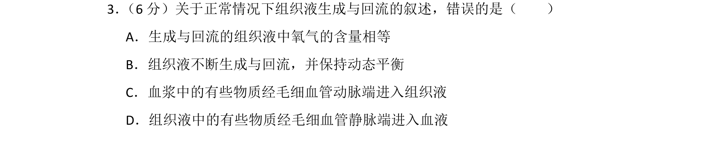
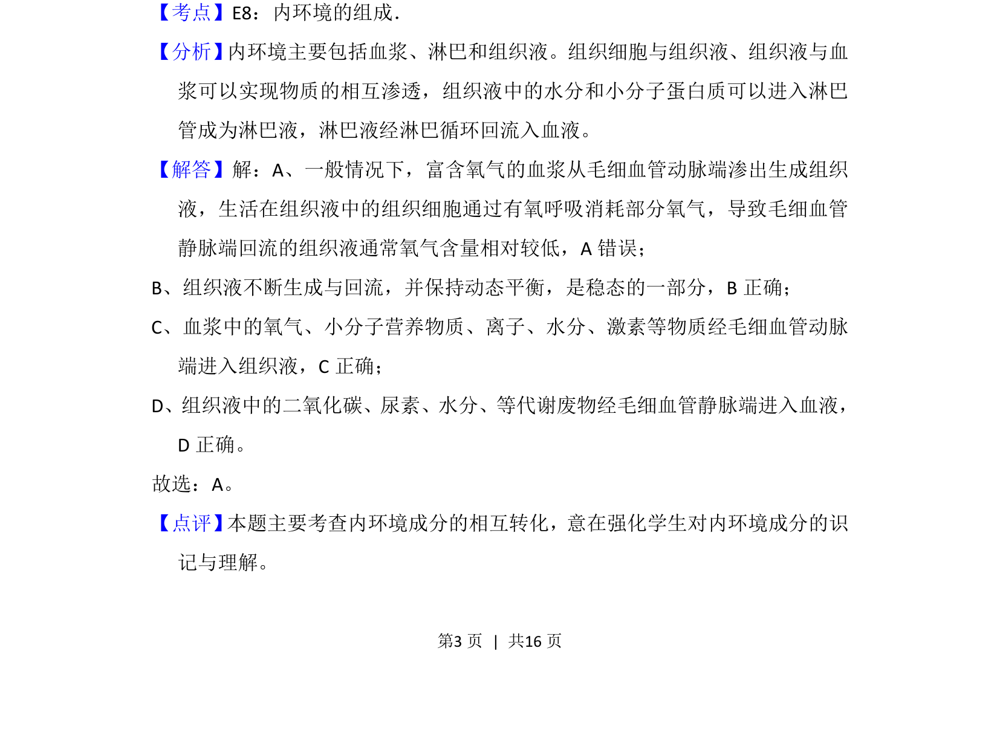

## 题面

## 摘要

考查细胞膜糖被的位置、本质和作用

## 关联考点

- [[044-细胞膜|细胞膜]]
- [[674-糖蛋白|糖蛋白]]
- [[812-识别|识别]]

## 答案与解析

> 📄 原 PDF 第 3 页：`素材/真题/吉林/2008-2024·（吉林）生物高考真题/2014年高考生物试卷（新课标Ⅱ）（解析卷）.pdf`

<!-- 题干文本-start -->
## 题干文本
3． （6分）关于正常情况下组织液生成与回流的叙述，错误的是（　　）
A．生成与回流的组织液中氧气的含量相等
B．组织液不断生成与回流，并保持动态平衡
C．血浆中的有些物质经毛细血管动脉端进入组织液
D．组织液中的有些物质经毛细血管静脉端进入血液
<!-- 题干文本-end -->

<!-- 解析文本-start -->
## 解析文本
【考点】E8：内环境的组成．菁优网版权所有
【分析】 内环境主要包括血浆、淋巴和组织液。组织细胞与组织液、组织液与血
浆可以实现物质的相互渗透，组织液中的水分和小分子蛋白质可以进入淋巴
管成为淋巴液，淋巴液经淋巴循环回流入血液。
【解答】解：A、一般情况下，富含氧气的血浆从毛细血管动脉端渗出生成组织
液，生活在组织液中的组织细胞通过有氧呼吸消耗部分氧气，导致毛细血管
静脉端回流的组织液通常氧气含量相对较低，A错误；
B、组织液不断生成与回流，并保持动态平衡，是稳态的一部分，B正确；
C、血浆中的氧气、小分子营养物质、离子、水分、激素等物质经毛细血管动脉
端进入组织液，C正确；
D、组织液中的二氧化碳、尿素、水分、等代谢废物经毛细血管静脉端进入血液，
D正确。
故选：A。
【点评】 本题主要考查内环境成分的相互转化，意在强化学生对内环境成分的识
记与理解。
<!-- 解析文本-end -->
