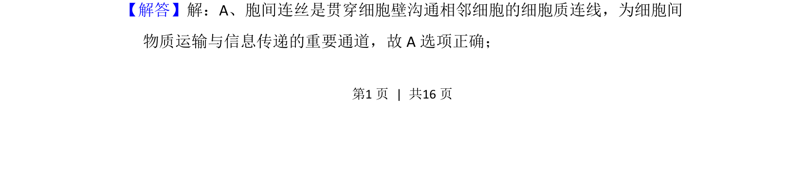

## 题面

## 摘要

该题考查胞间连丝在细胞间物质运输与信息传递中的作用。

## 关联考点

- [[688-胞间连丝|胞间连丝]]
- [[507-细胞间信息交流|细胞间信息交流]]
- [[636-物质运输|物质运输]]

## 答案与解析

> 📄 原 PDF 第 4 页：`素材/真题/吉林/2008-2024·（吉林）生物高考真题/2014年高考生物试卷（新课标Ⅱ）（解析卷）.pdf`
