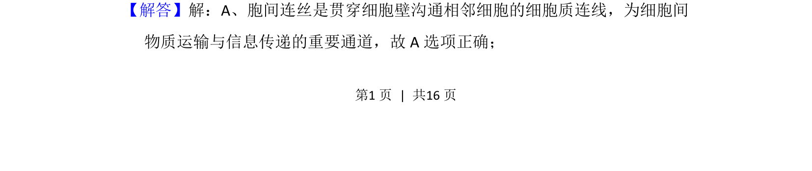

## 题面

## 摘要

该题考查胞间连丝在细胞间物质运输与信息传递中的作用。

## 关联考点

- [[688-胞间连丝|胞间连丝]]
- [[507-细胞间信息交流|细胞间信息交流]]
- [[636-物质运输|物质运输]]

## 答案与解析

> 📄 原 PDF 第 4 页：`素材/真题/吉林/2008-2024·（吉林）生物高考真题/2014年高考生物试卷（新课标Ⅱ）（解析卷）.pdf`

<!-- 题干文本-start -->
## 题干文本
4． （6分）将某植物花冠切成大小和形状相同的细条，分为a、b、c、d、e和f
组（每组的细条数相等） ，取上述6组细条分别置于不同浓度的蔗糖溶液中，
浸泡相同时间后测量各组花冠细条的长度，结果如图所示。假如蔗糖溶液与
花冠细胞之间只有水分交换，则（　　）
A．实验后，a组液泡中的溶质浓度比b组的高
B．浸泡导致f组细胞中液泡的失水量小于b组的
C．a组细胞在蔗糖溶液中失水或吸水所耗ATP大于b组
D．使细条在浸泡前后长度不变的蔗糖浓度介于0.4～0.5mol•L ﹣1之间
<!-- 题干文本-end -->

<!-- 解析文本-start -->
## 解析文本
【考点】32：细胞质壁分离与质壁分离复原现象及其原因．菁优网版权所有
【分析】实验前长度/实验后长度的比值为1时，水分进出细胞达到平衡；比值
小于1表明细胞吸水，且比值越小花冠吸水越多，则吸水量a＞b＞c； 比值大
于1表明细胞失水，且比值越大，花冠失水越多，则失水量d＜e＜f。
【解答】解：A、据图可推知a组吸水多于b组，因此实验后a组细胞液中溶质
浓度低于b组，故A选项错误；
B、比值小于1表明细胞吸水，则b组细胞吸水；比值大于1表明细胞失水，则
f组细胞失水，因此浸泡导致f组细胞中液泡的失水量＞b组，故B选项错误 ；
C、水分子进出细胞的方式是自由扩散，不消耗能量，故C选项错误；
D、由c组吸水，d组失水知细条细胞液浓度介于0.4～0.5mol﹒L﹣1之间，故D
选项正确。
故选：D。
【点评】 本题考查渗透作用的相关知识，意在考查学生的识图和判断能力，属于
<!-- 解析文本-end -->
