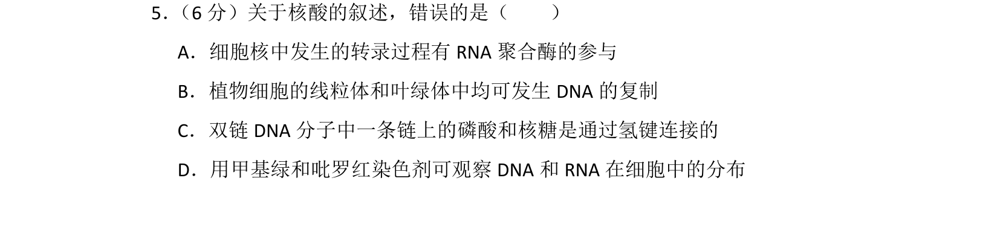
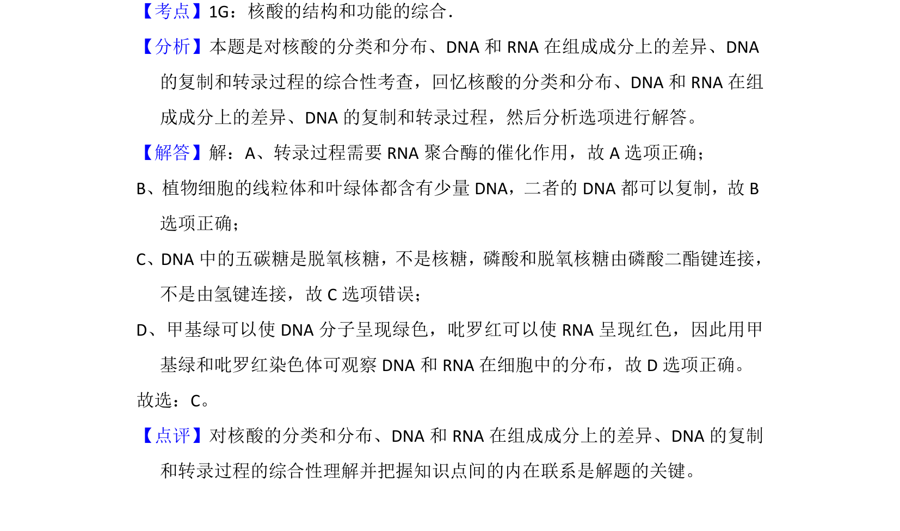

## 题面

## 摘要

本题为生物学科内容，考查核酸的结构、分布及DNA复制和转录过程的综合理解。

## 关联考点

- [[618-核酸结构|核酸结构]]
- [[285-DNA复制|DNA复制]]
- [[298-转录|转录]]
- [[708-观察实验|观察实验]]

## 答案与解析

> 📄 原 PDF 第 5 页：`素材/真题/吉林/2008-2024·（吉林）生物高考真题/2014年高考生物试卷（新课标Ⅱ）（解析卷）.pdf`
