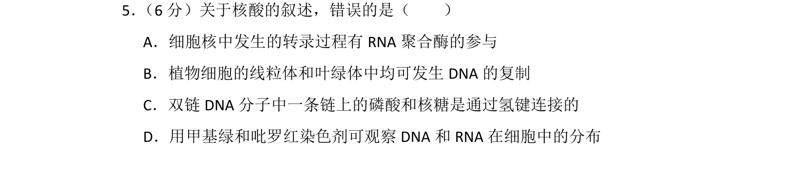
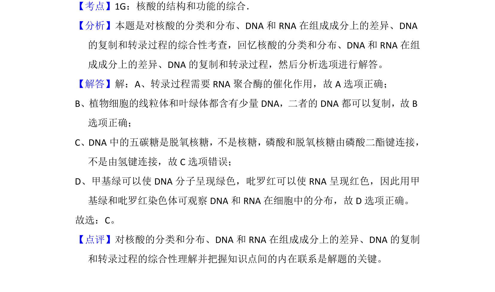

## 题面

## 摘要

本题为生物学科内容，考查核酸的结构、分布及DNA复制和转录过程的综合理解。

## 关联考点

- [[618-核酸结构|核酸结构]]
- [[285-DNA复制|DNA复制]]
- [[298-转录|转录]]
- [[708-观察实验|观察实验]]

## 答案与解析

> 📄 原 PDF 第 5 页：`素材/真题/吉林/2008-2024·（吉林）生物高考真题/2014年高考生物试卷（新课标Ⅱ）（解析卷）.pdf`

<!-- 题干文本-start -->
## 题干文本
5． （6分）关于核酸的叙述，错误的是（　　）
A．细胞核中发生的转录过程有RNA聚合酶的参与
B．植物细胞的线粒体和叶绿体中均可发生DNA的复制
C．双链DNA分子中一条链上的磷酸和核糖是通过氢键连接的
D．用甲基绿和吡罗红染色剂可观察DNA和RNA在细胞中的分布
<!-- 题干文本-end -->

<!-- 解析文本-start -->
## 解析文本
【考点】1G：核酸的结构和功能的综合．菁优网版权所有
【分析】本题是对核酸的分类和分布、DNA和RNA在组成成分上的差异、DNA
的复制和转录过程的综合性考查，回忆核酸的分类和分布、DNA和RNA在组
成成分上的差异、DNA的复制和转录过程，然后分析选项进行解答。
【解答】解：A、转录过程需要RNA聚合酶的催化作用，故A选项正确；
B、植物细胞的线粒体和叶绿体都含有少量DNA，二者的DNA都可以复制，故B
选项正确；
C、DNA中的五碳糖是脱氧核糖，不是核糖，磷酸和脱氧核糖由磷酸二酯键连接，
不是由氢键连接，故C选项错误；
D、甲基绿可以使DNA分子呈现绿色，吡罗红可以使RNA呈现红色，因此用甲
基绿和吡罗红染色体可观察DNA和RNA在细胞中的分布，故D选项正确。
故选：C。
【点评】对核酸的分类和分布、DNA和RNA在组成成分上的差异、DNA的复制
和转录过程的综合性理解并把握知识点间的内在联系是解题的关键。
<!-- 解析文本-end -->
