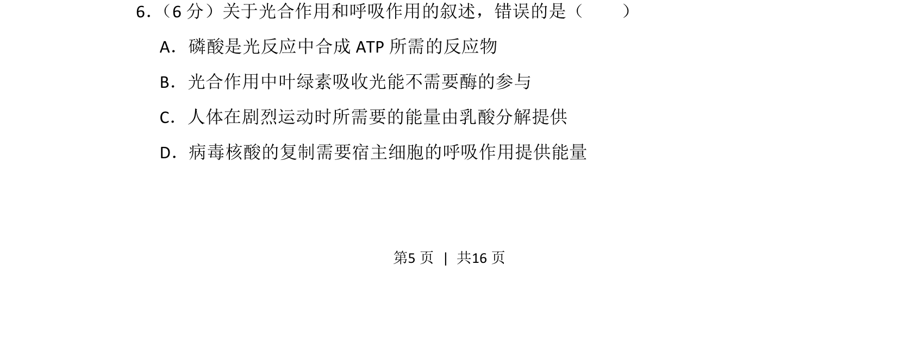
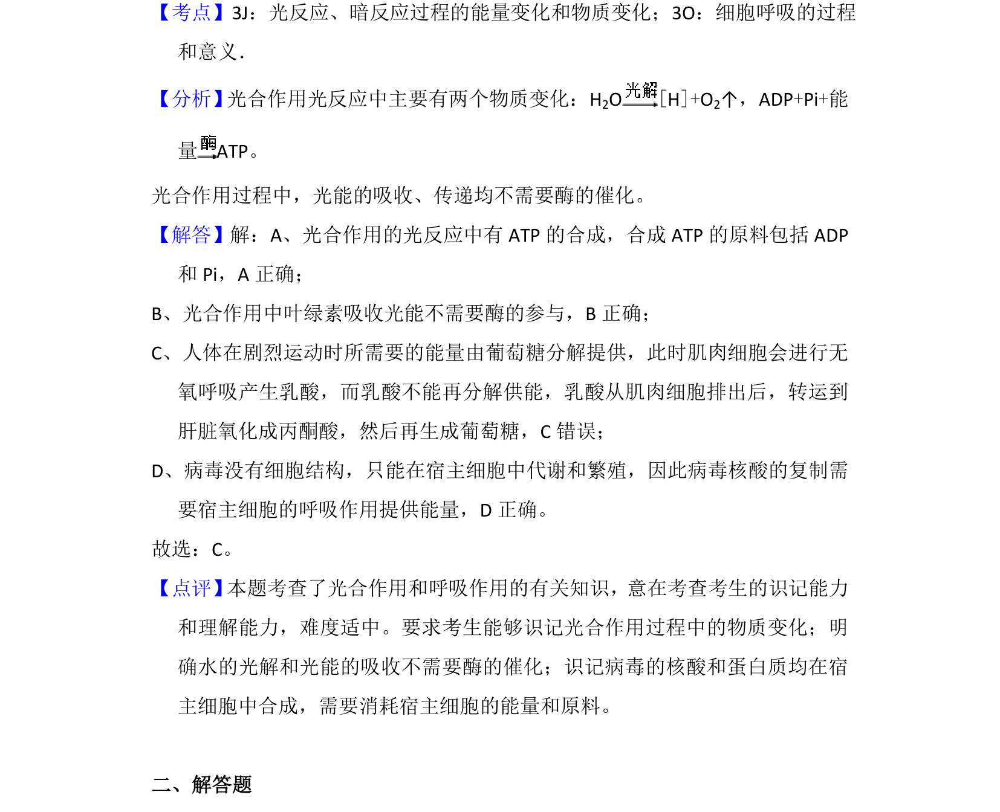

## 题面

## 摘要

考查光合作用和呼吸作用的基本过程及相关物质和能量变化。

## 关联考点

- [[033-光合作用|光合作用]]
- [[031-呼吸作用|呼吸作用]]
- [[ATP合成]]
- [[能量代谢]]

## 答案与解析

> 📄 原 PDF 第 5 页：`素材/真题/吉林/2008-2024·（吉林）生物高考真题/2014年高考生物试卷（新课标Ⅱ）（解析卷）.pdf`
