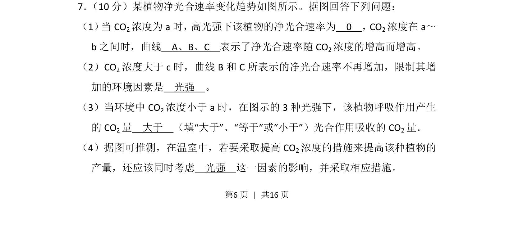
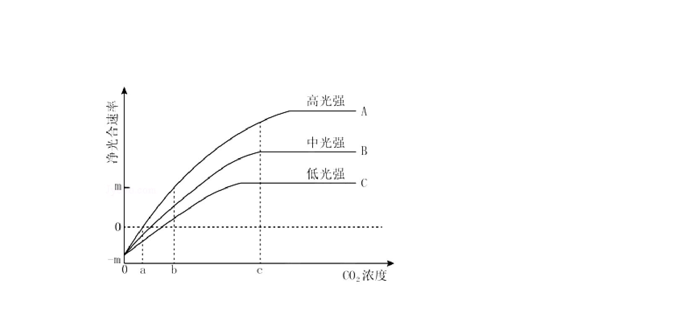
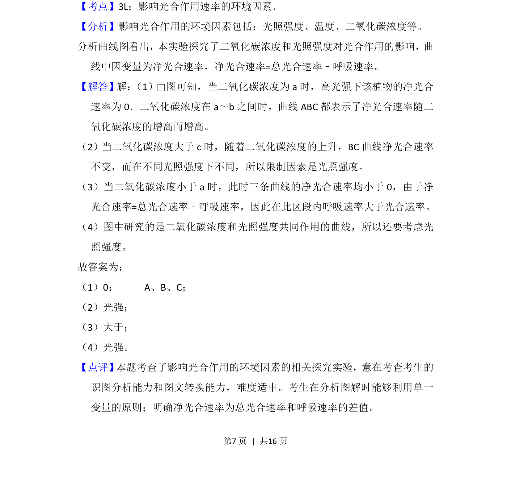

## 题面

## 摘要

该题通过曲线图分析光强和CO2浓度对植物净光合速率的影响，考查光合作用与呼吸作用关系。

## 关联考点

- [[033-光合作用|光合作用]]
- [[净光合速率]]
- [[光强]]
- [[CO2浓度]]

## 答案与解析

> 📄 原 PDF 第 6 页：`素材/真题/吉林/2008-2024·（吉林）生物高考真题/2014年高考生物试卷（新课标Ⅱ）（解析卷）.pdf`
