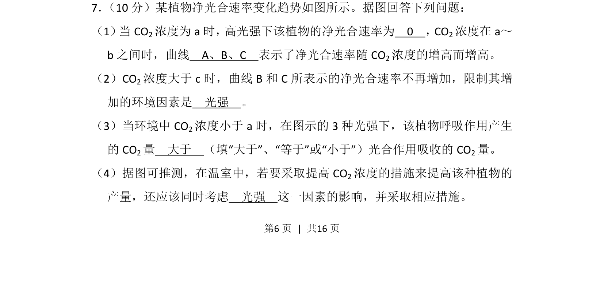
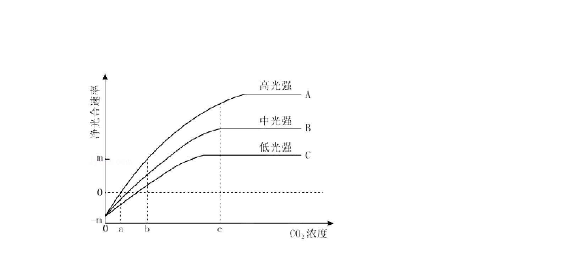
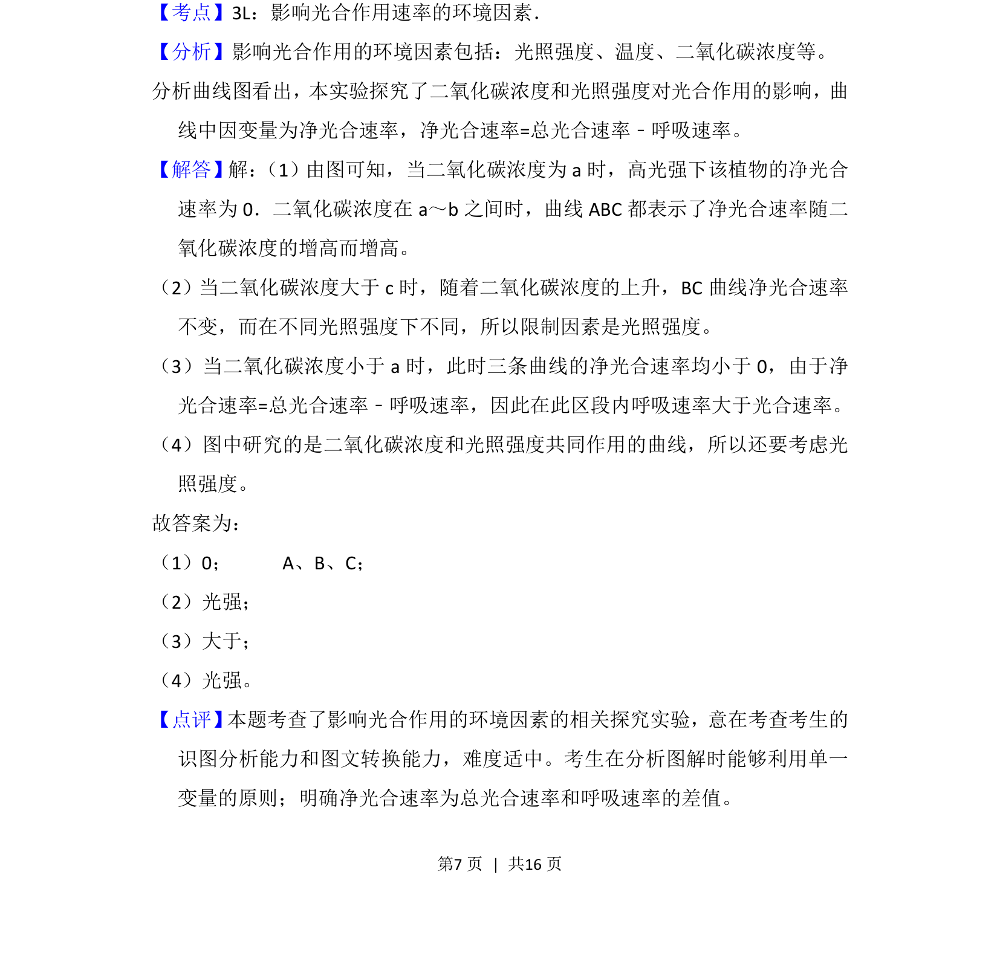

## 题面

## 摘要

该题通过曲线图分析光强和CO2浓度对植物净光合速率的影响，考查光合作用与呼吸作用关系。

## 关联考点

- [[033-光合作用|光合作用]]
- [[552-净光合速率|净光合速率]]
- [[454-光强|光强]]
- [[523-CO2浓度|CO2浓度]]

## 答案与解析

> 📄 原 PDF 第 6 页：`素材/真题/吉林/2008-2024·（吉林）生物高考真题/2014年高考生物试卷（新课标Ⅱ）（解析卷）.pdf`

<!-- 题干文本-start -->
## 题干文本
7． （10分）某植物净光合速率变化趋势如图所示。据图回答下列问题：
（1） 当CO2浓度为a时， 高光强下该植物的净光合速率为　0　，CO2浓度在a～
b之间时，曲线　A、B、C　表示了净光合速率随CO 2浓度的增高而增高。
（2）CO2浓度大于c时，曲线B和C所表示的净光合速率不再增加，限制其增
加的环境因素是　光强　。
（3）当环境中CO 2浓度小于a时，在图示的3种光强下，该植物呼吸作用产生
的CO 2量　大于　（填“大于”、“等于”或“小于”）光合作用吸收的CO 2量。
（4）据图可推测，在温室中，若要采取提高CO 2浓度的措施来提高该种植物的
产量，还应该同时考虑　光强　这一因素的影响，并采取相应措施。
<!-- 题干文本-end -->

<!-- 解析文本-start -->
## 解析文本

<!-- 解析文本-end -->
