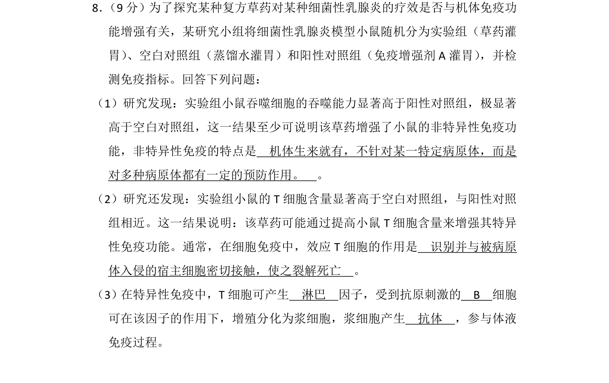
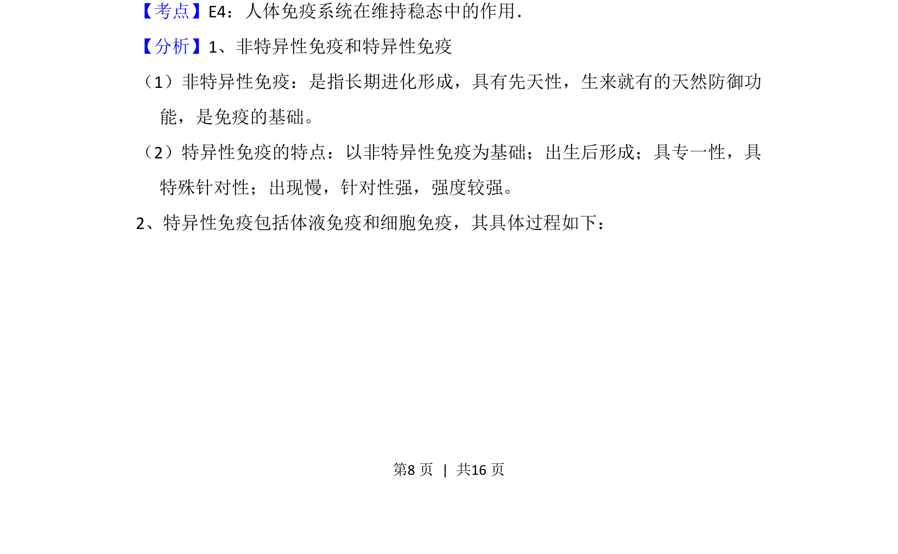
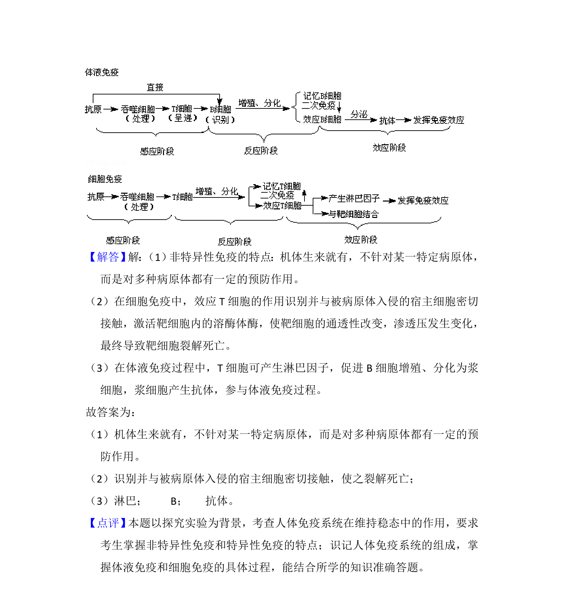

## 题面

## 摘要

探究草药对小鼠免疫功能的影响，考查非特异性免疫特点及特异性免疫过程。

## 关联考点

- [[540-人体免疫系统在维持稳态中的作用|人体免疫系统在维持稳态中的作用]]
- [[739-非特异性免疫|非特异性免疫]]
- [[637-特异性免疫|特异性免疫]]
- [[359-细胞免疫|细胞免疫]]
- [[353-体液免疫|体液免疫]]

## 答案与解析

> 📄 原 PDF 第 8 页：`素材/真题/吉林/2008-2024·（吉林）生物高考真题/2014年高考生物试卷（新课标Ⅱ）（解析卷）.pdf`

<!-- 题干文本-start -->
## 题干文本
8． （9分）为了探究某种复方草药对某种细菌性乳腺炎的疗效是否与机体免疫功
能增强有关，某研究小组将细菌性乳腺炎模型小鼠随机分为实验组（草药灌
胃） 、空白对照组（蒸馏水灌胃）和阳性对照组（免疫增强剂A灌胃） ，并检
测免疫指标。回答下列问题：
（1）研究发现：实验组小鼠吞噬细胞的吞噬能力显著高于阳性对照组，极显著
高于空白对照组，这一结果至少可说明该草药增强了小鼠的非特异性免疫功
能，非特异性免疫的特点是　机体生来就有，不针对某一特定病原体，而是
对多种病原体都有一定的预防作用。　。
（2）研究还发现：实验组小鼠的T细胞含量显著高于空白对照组，与阳性对照
组相近。这一结果说明：该草药可能通过提高小鼠T细胞含量来增强其特异
性免疫功能。通常，在细胞免疫中，效应T细胞的作用是　识别并与被病原
体入侵的宿主细胞密切接触，使之裂解死亡　。
（3）在特异性免疫中，T细胞可产生　淋巴　因子，受到抗原刺激的　B　细胞
可在该因子的作用下，增殖分化为浆细胞，浆细胞产生　抗体　，参与体液
免疫过程。
<!-- 题干文本-end -->

<!-- 解析文本-start -->
## 解析文本
【考点】E4：人体免疫系统在维持稳态中的作用．菁优网版权所有
【分析】1、非特异性免疫和特异性免疫
（1）非特异性免疫：是指长期进化形成，具有先天性，生来就有的天然防御功
能，是免疫的基础。 
（2）特异性免疫的特点：以非特异性免疫为基础；出生后形成；具专一性，具
特殊针对性；出现慢，针对性强，强度较强。
2、特异性免疫包括体液免疫和细胞免疫，其具体过程如下：
<!-- 解析文本-end -->
