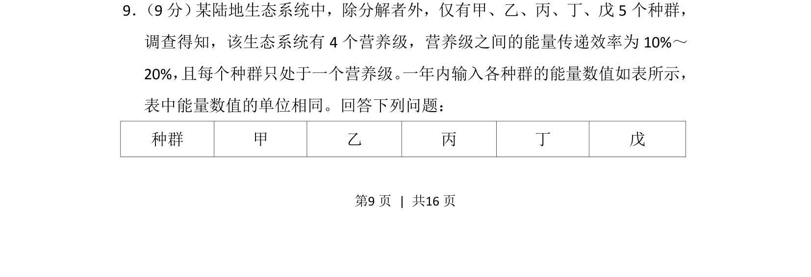
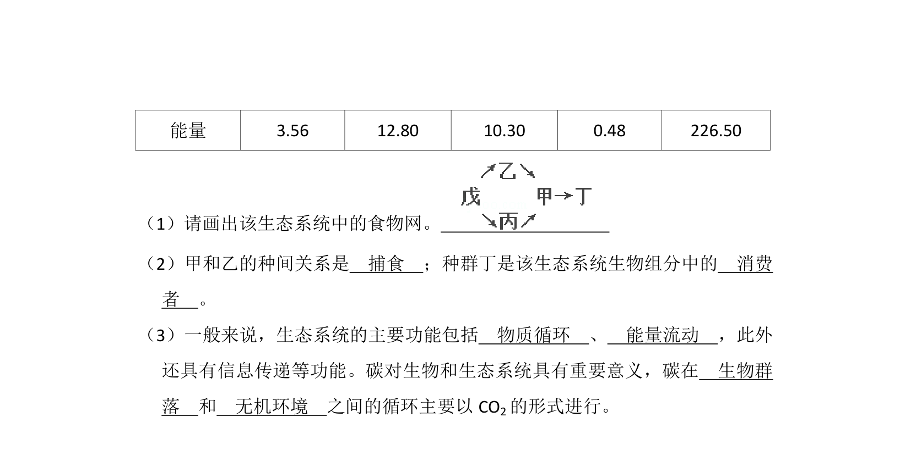
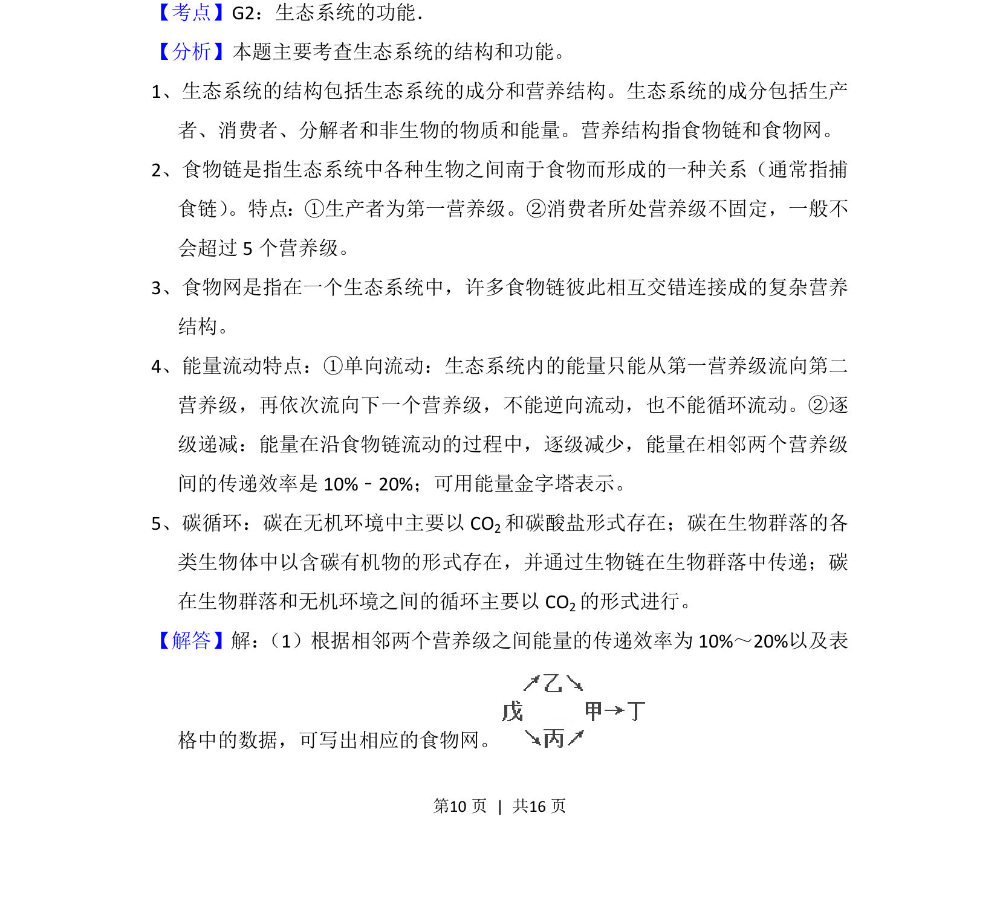
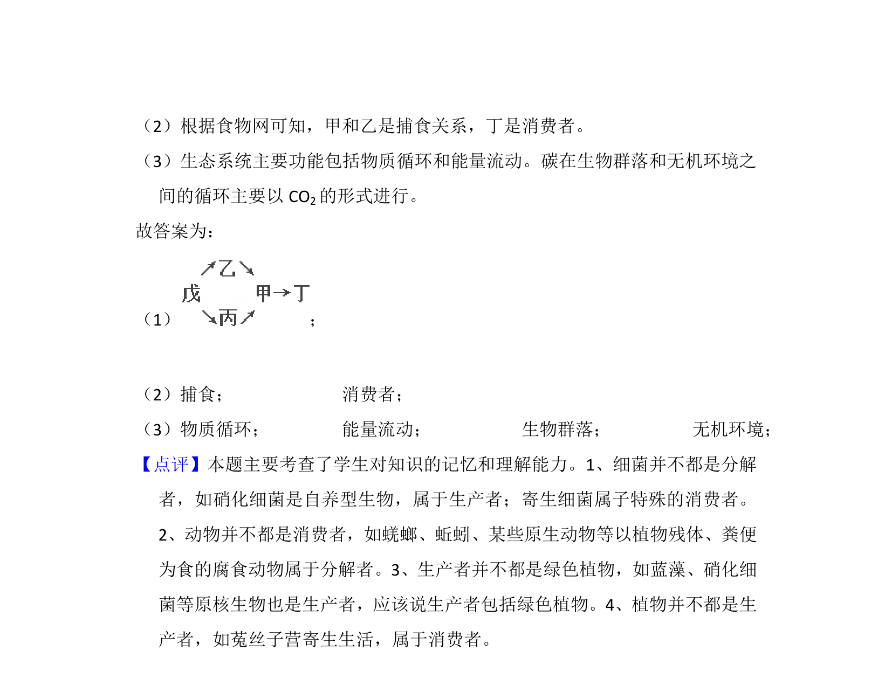

## 题面

## 摘要

考查生态系统能量流动，根据各营养级能量数值计算传递效率并判断营养级结构。

## 关联考点

- [[385-生态系统能量流动|生态系统能量流动]]
- [[389-营养级|营养级]]
- [[771-能量传递效率|能量传递效率]]

## 答案与解析

> 📄 原 PDF 第 9 页：`素材/真题/吉林/2008-2024·（吉林）生物高考真题/2014年高考生物试卷（新课标Ⅱ）（解析卷）.pdf`

<!-- 题干文本-start -->
## 题干文本
9． （9分） 某陆地生态系统中，除分解者外，仅有甲、乙、丙、丁、戊5个种群，
调查得知，该生态系统有4个营养级，营养级之间的能量传递效率为10%～
20%， 且每个种群只处于一个营养级。 一年内输入各种群的能量数值如表所示，
表中能量数值的单位相同。回答下列问题：
种群 甲 乙 丙 丁 戊
<!-- 题干文本-end -->

<!-- 解析文本-start -->
## 解析文本

<!-- 解析文本-end -->
