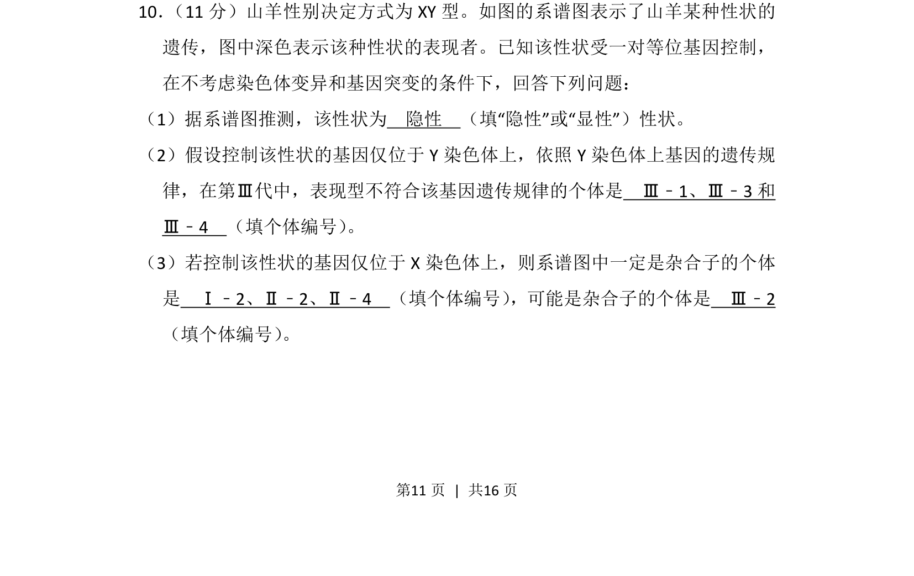
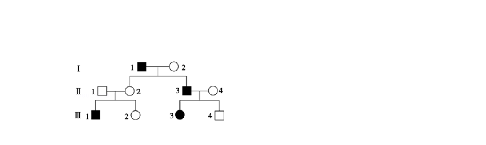
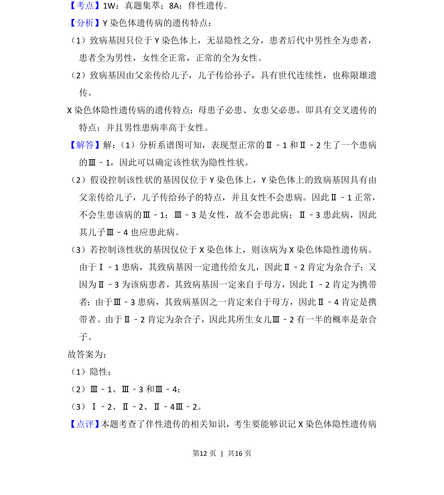
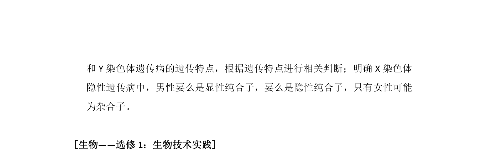

## 题面

## 摘要

该题通过山羊系谱图考查遗传方式判断、伴性遗传规律及杂合子推断。

## 关联考点

- [[遗传系谱图分析]]
- [[基因定位]]
- [[276-伴性遗传|伴性遗传]]
- [[杂合子判断]]

## 答案与解析

> 📄 原 PDF 第 11 页：`素材/真题/吉林/2008-2024·（吉林）生物高考真题/2014年高考生物试卷（新课标Ⅱ）（解析卷）.pdf`
