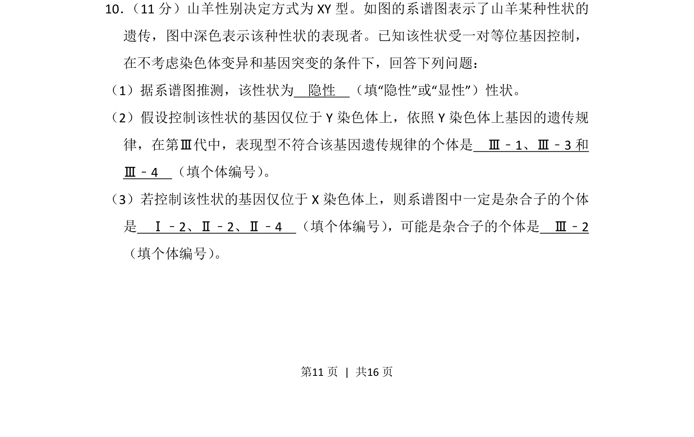
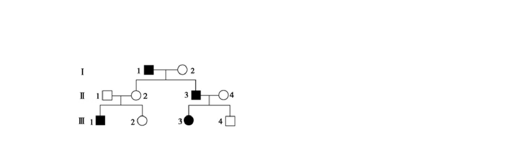
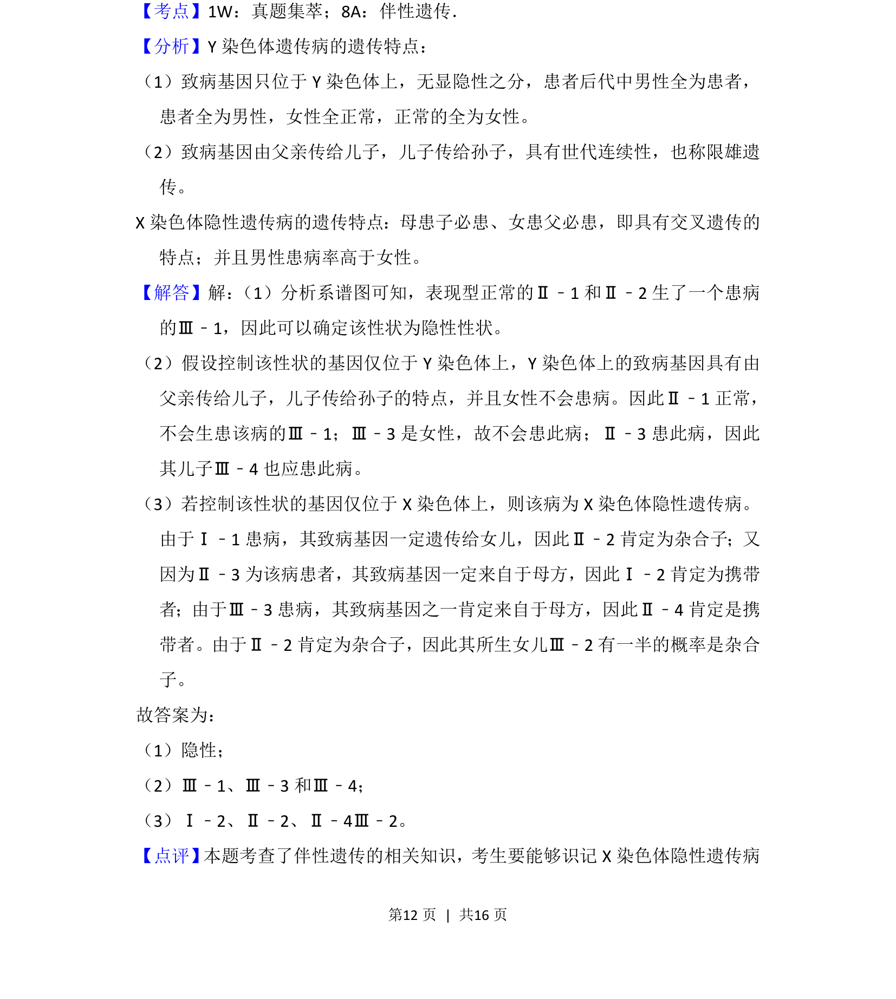
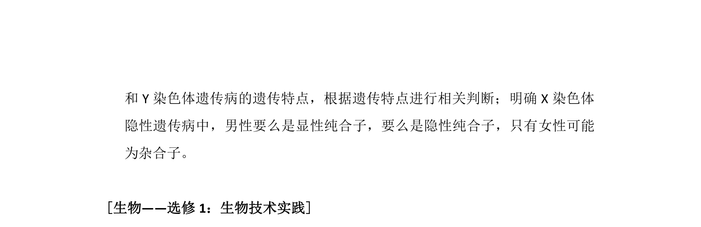

## 题面

## 摘要

该题通过山羊系谱图考查遗传方式判断、伴性遗传规律及杂合子推断。

## 关联考点

- [[516-遗传系谱图分析|遗传系谱图分析]]
- [[478-基因定位|基因定位]]
- [[276-伴性遗传|伴性遗传]]
- [[806-杂合子判断|杂合子判断]]

## 答案与解析

> 📄 原 PDF 第 11 页：`素材/真题/吉林/2008-2024·（吉林）生物高考真题/2014年高考生物试卷（新课标Ⅱ）（解析卷）.pdf`

<!-- 题干文本-start -->
## 题干文本
10． （11分）山羊性别决定方式为XY型。如图的系谱图表示了山羊某种性状的
遗传，图中深色表示该种性状的表现者。已知该性状受一对等位基因控制，
在不考虑染色体变异和基因突变的条件下，回答下列问题：
（1）据系谱图推测，该性状为　隐性　（填“隐性”或“显性”）性状。
（2）假设控制该性状的基因仅位于Y染色体上，依照Y染色体上基因的遗传规
律，在第Ⅲ代中，表现型不符合该基因遗传规律的个体是　Ⅲ﹣1、Ⅲ﹣3和
Ⅲ﹣4　（填个体编号） 。
（3）若控制该性状的基因仅位于X染色体上，则系谱图中一定是杂合子的个体
是　Ⅰ﹣2、Ⅱ﹣2、Ⅱ﹣4　（填个体编号） ，可能是杂合子的个体是　Ⅲ﹣2　
（填个体编号） 。
<!-- 题干文本-end -->

<!-- 解析文本-start -->
## 解析文本

<!-- 解析文本-end -->
