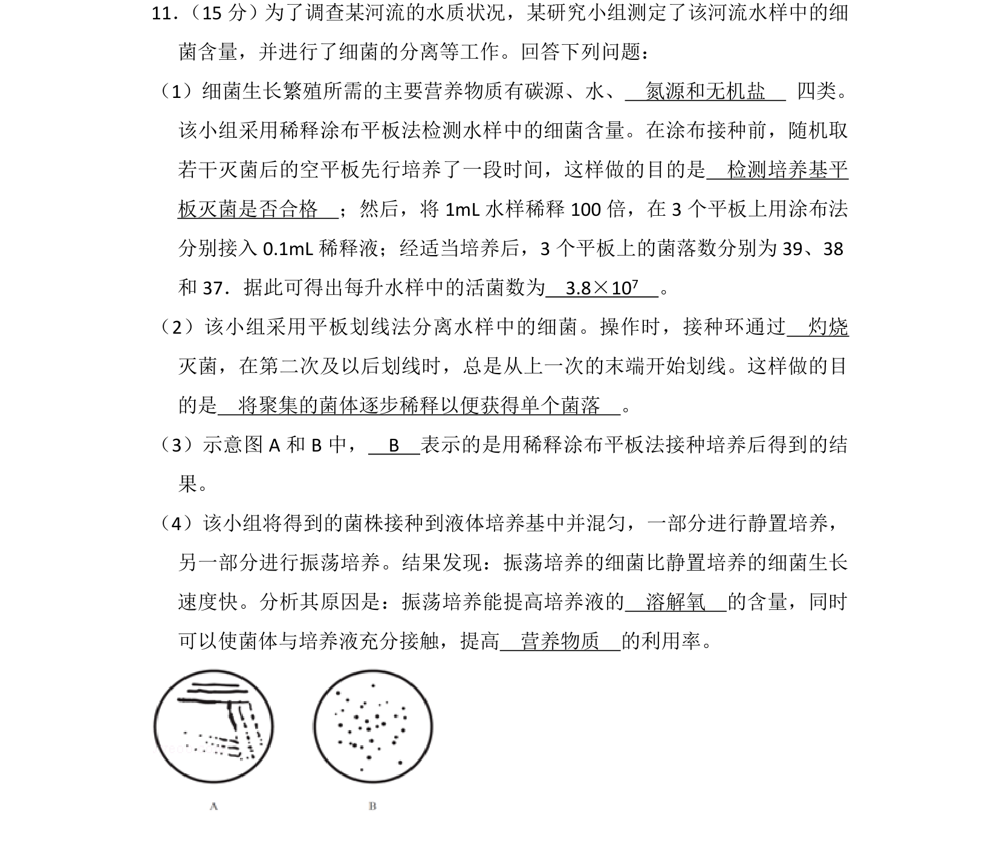
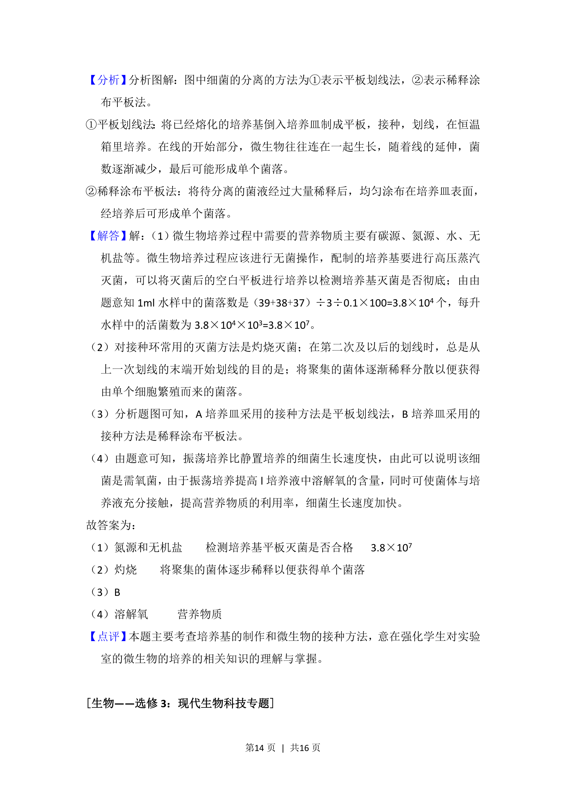

## 题面

## 摘要

考查细菌培养所需的营养物质、灭菌方法、接种技术及菌落计数等微生物实验基础。

## 关联考点

- [[599-微生物的分离和培养|微生物的分离和培养]]
- [[755-稀释涂布平板法|稀释涂布平板法]]
- [[594-平板划线法|平板划线法]]
- [[758-活菌计数|活菌计数]]

## 答案与解析

> 📄 原 PDF 第 13 页：`素材/真题/吉林/2008-2024·（吉林）生物高考真题/2014年高考生物试卷（新课标Ⅱ）（解析卷）.pdf`
