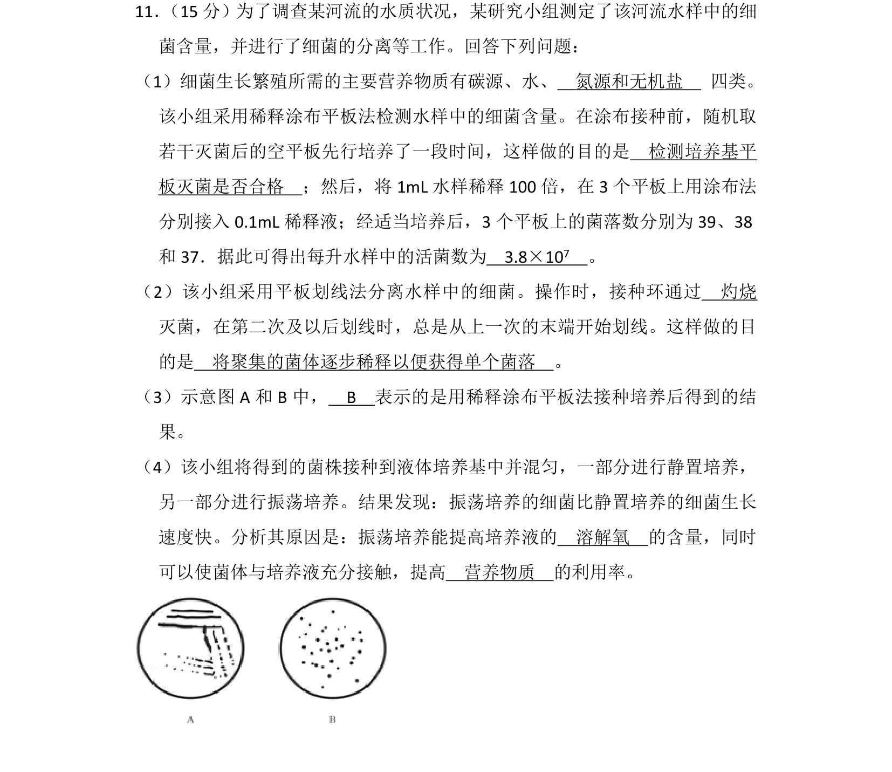
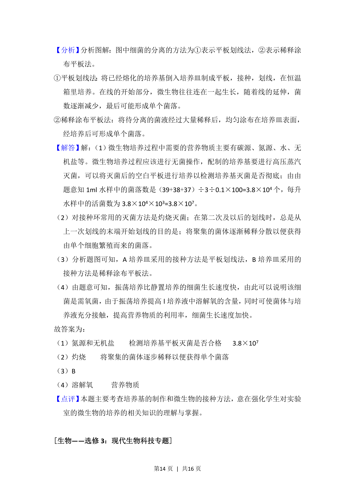

## 题面

## 摘要

考查细菌培养所需的营养物质、灭菌方法、接种技术及菌落计数等微生物实验基础。

## 关联考点

- [[599-微生物的分离和培养|微生物的分离和培养]]
- [[755-稀释涂布平板法|稀释涂布平板法]]
- [[594-平板划线法|平板划线法]]
- [[758-活菌计数|活菌计数]]

## 答案与解析

> 📄 原 PDF 第 13 页：`素材/真题/吉林/2008-2024·（吉林）生物高考真题/2014年高考生物试卷（新课标Ⅱ）（解析卷）.pdf`

<!-- 题干文本-start -->
## 题干文本
11． （15分）为了调查某河流的水质状况，某研究小组测定了该河流水样中的细
菌含量，并进行了细菌的分离等工作。回答下列问题：
（1）细菌生长繁殖所需的主要营养物质有碳源、水、　氮源和无机盐　 四类。
该小组采用稀释涂布平板法检测水样中的细菌含量。在涂布接种前，随机取
若干灭菌后的空平板先行培养了一段时间，这样做的目的是　检测培养基平
板灭菌是否合格　；然后，将1mL水样稀释100倍，在3个平板上用涂布法
分别接入0.1mL稀释液；经适当培养后，3个平板上的菌落数分别为39、38
和37．据此可得出每升水样中的活菌数为　3.8×10 7　。
（2）该小组采用平板划线法分离水样中的细菌。操作时，接种环通过　灼烧　
灭菌，在第二次及以后划线时，总是从上一次的末端开始划线。这样做的目
的是　将聚集的菌体逐步稀释以便获得单个菌落　。
（3）示意图A和B中，　B　表示的是用稀释涂布平板法接种培养后得到的结
果。
（4）该小组将得到的菌株接种到液体培养基中并混匀，一部分进行静置培养，
另一部分进行振荡培养。结果发现：振荡培养的细菌比静置培养的细菌生长
速度快。分析其原因是：振荡培养能提高培养液的　溶解氧　的含量，同时
可以使菌体与培养液充分接触，提高　营养物质　的利用率。
<!-- 题干文本-end -->

<!-- 解析文本-start -->
## 解析文本
【考点】I1：微生物的分离和培养．菁优网版权所有
【专题】114：实验性简答题；541：微生物的分离、培养和应用．
<!-- 解析文本-end -->
