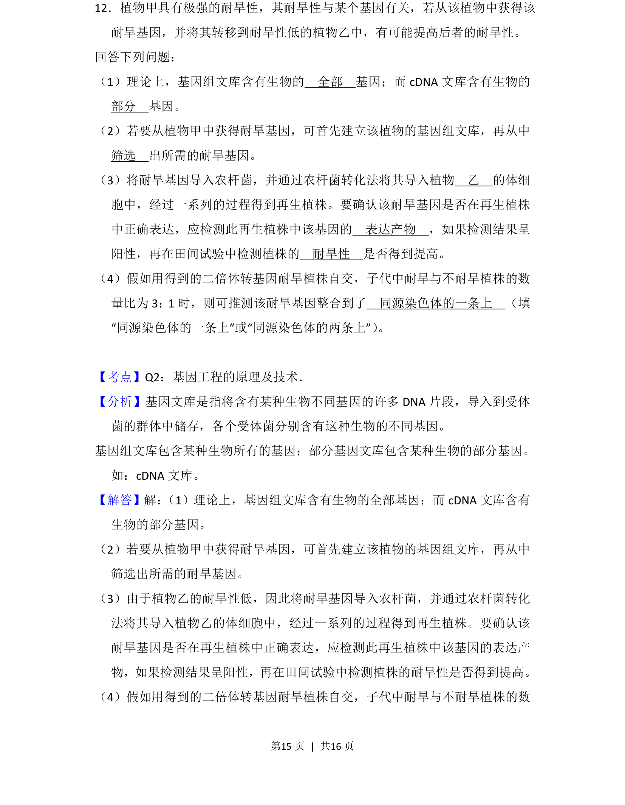

## 题面

## 摘要

本题主要考查基因工程中基因组文库与cDNA文库区别及目的基因的导入与检测。

## 关联考点

- [[411-基因工程|基因工程]]
- [[基因文库]]
- [[农杆菌转化法]]
- [[目的基因检测]]

## 答案与解析

> 📄 原 PDF 第 15 页：`素材/真题/吉林/2008-2024·（吉林）生物高考真题/2014年高考生物试卷（新课标Ⅱ）（解析卷）.pdf`
