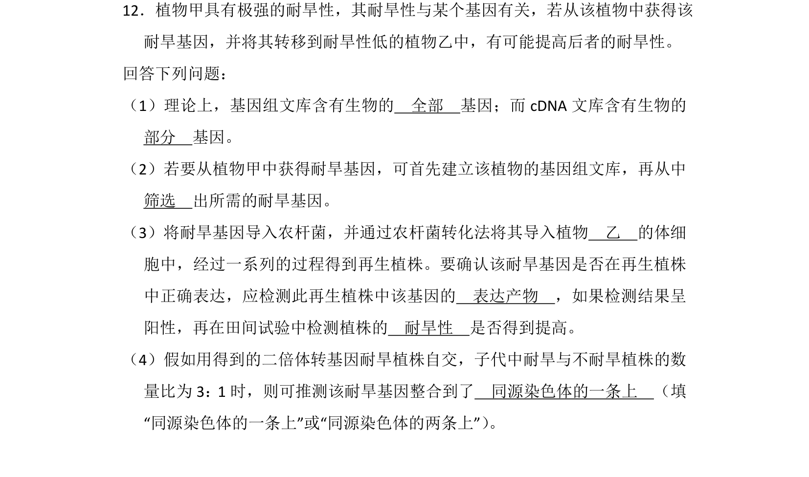
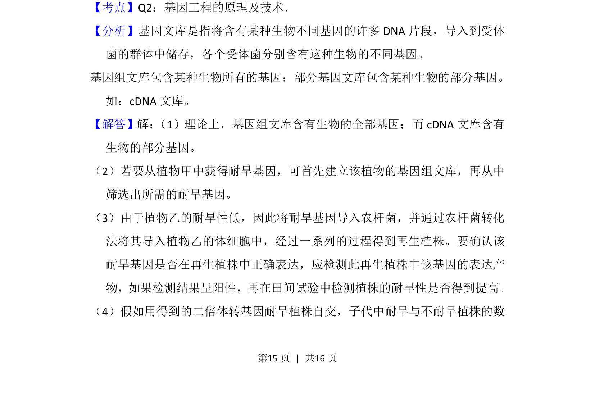
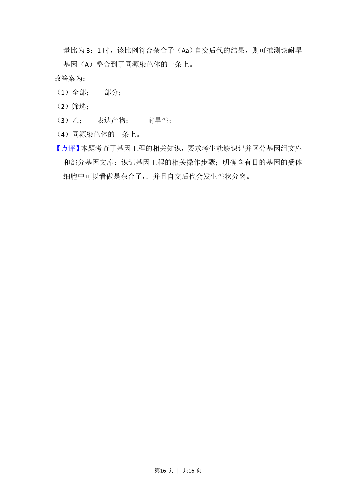

## 题面

## 摘要

本题主要考查基因工程中基因组文库与cDNA文库区别及目的基因的导入与检测。

## 关联考点

- [[411-基因工程|基因工程]]
- [[577-基因文库|基因文库]]
- [[551-农杆菌转化法|农杆菌转化法]]
- [[747-目的基因检测|目的基因检测]]

## 答案与解析

> 📄 原 PDF 第 15 页：`素材/真题/吉林/2008-2024·（吉林）生物高考真题/2014年高考生物试卷（新课标Ⅱ）（解析卷）.pdf`

<!-- 题干文本-start -->
## 题干文本
12．植物甲具有极强的耐旱性，其耐旱性与某个基因有关，若从该植物中获得该
耐旱基因，并将其转移到耐旱性低的植物乙中，有可能提高后者的耐旱性。
回答下列问题：
（1）理论上，基因组文库含有生物的　全部　基因；而cDNA文库含有生物的　
部分　基因。
（2）若要从植物甲中获得耐旱基因，可首先建立该植物的基因组文库，再从中　
筛选　出所需的耐旱基因。
（3）将耐旱基因导入农杆菌，并通过农杆菌转化法将其导入植物　乙　的体细
胞中，经过一系列的过程得到再生植株。要确认该耐旱基因是否在再生植株
中正确表达，应检测此再生植株中该基因的　表达产物　，如果检测结果呈
阳性，再在田间试验中检测植株的　耐旱性　是否得到提高。
（4）假如用得到的二倍体转基因耐旱植株自交，子代中耐旱与不耐旱植株的数
量比为3：1时，则可推测该耐旱基因整合到了　同源染色体的一条上　（填
“同源染色体的一条上”或“同源染色体的两条上”） 。
<!-- 题干文本-end -->

<!-- 解析文本-start -->
## 解析文本
【考点】Q2：基因工程的原理及技术．菁优网版权所有
【分析】基因文库是指将含有某种生物不同基因的许多DNA片段，导入到受体
菌的群体中储存，各个受体菌分别含有这种生物的不同基因。
基因组文库包含某种生物所有的基因；部分基因文库包含某种生物的部分基因。
如：cDNA文库。
【解答】解： （1）理论上，基因组文库含有生物的全部基因；而cDNA文库含有
生物的部分基因。
（2）若要从植物甲中获得耐旱基因，可首先建立该植物的基因组文库，再从中
筛选出所需的耐旱基因。
（3）由于植物乙的耐旱性低，因此将耐旱基因导入农杆菌，并通过农杆菌转化
法将其导入植物乙的体细胞中，经过一系列的过程得到再生植株。要确认该
耐旱基因是否在再生植株中正确表达，应检测此再生植株中该基因的表达产
物，如果检测结果呈阳性，再在田间试验中检测植株的耐旱性是否得到提高。
（4）假如用得到的二倍体转基因耐旱植株自交，子代中耐旱与不耐旱植株的数
<!-- 解析文本-end -->
