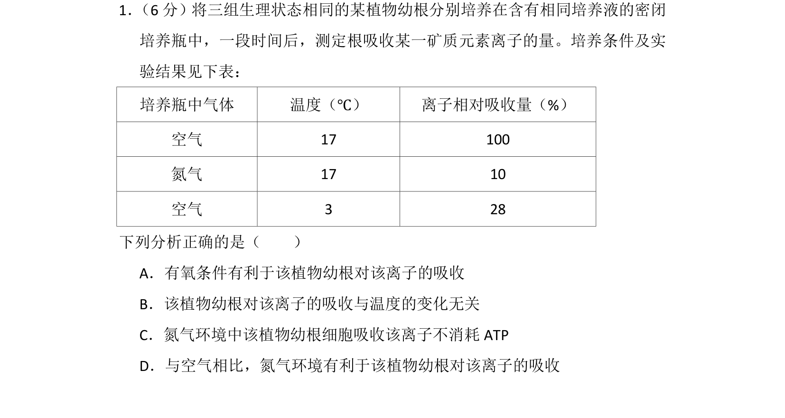
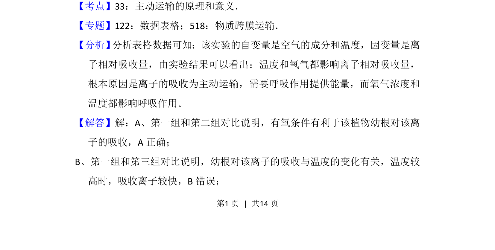
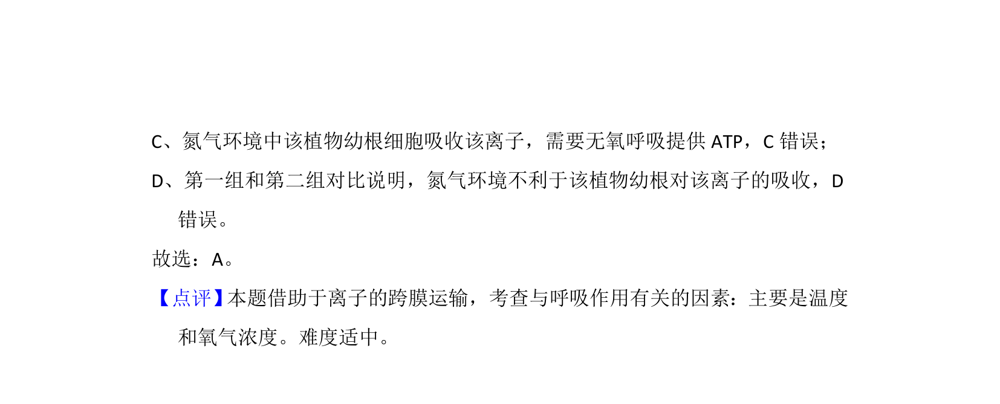

## 题面

## 摘要

通过实验数据表格分析氧气和温度对植物根吸收离子的影响，考查主动运输的条件。

## 关联考点

- [[256-主动运输|主动运输]]
- [[031-呼吸作用|呼吸作用]]
- [[480-实验变量分析|实验变量分析]]

## 答案与解析

> 📄 原 PDF 第 1 页：`素材/真题/吉林/2008-2024·（吉林）生物高考真题/2015年高考生物试卷（新课标Ⅱ）（解析卷）.pdf`
