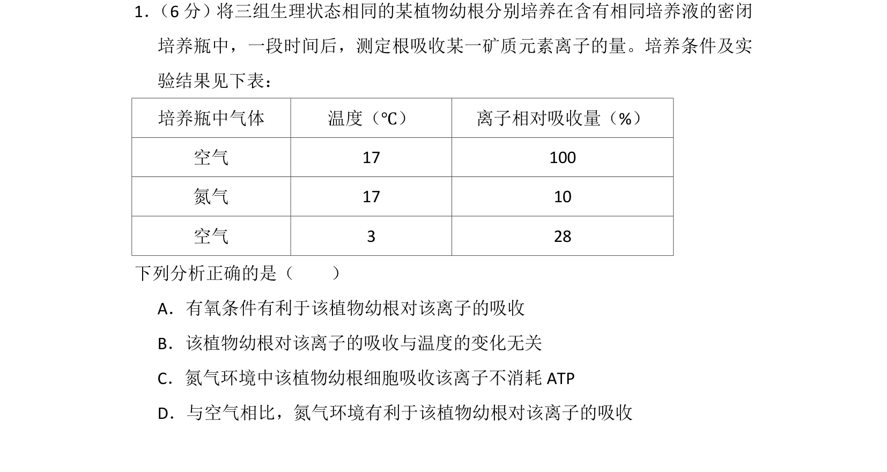
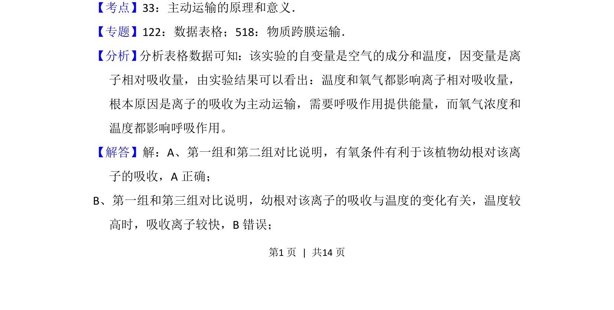
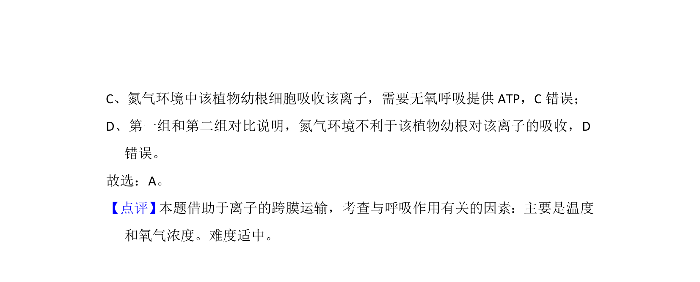

## 题面

## 摘要

通过实验数据表格分析氧气和温度对植物根吸收离子的影响，考查主动运输的条件。

## 关联考点

- [[256-主动运输|主动运输]]
- [[031-呼吸作用|呼吸作用]]
- [[480-实验变量分析|实验变量分析]]

## 答案与解析

> 📄 原 PDF 第 1 页：`素材/真题/吉林/2008-2024·（吉林）生物高考真题/2015年高考生物试卷（新课标Ⅱ）（解析卷）.pdf`

<!-- 题干文本-start -->
## 题干文本
1． （6分）将三组生理状态相同的某植物幼根分别培养在含有相同培养液的密闭
培养瓶中，一段时间后，测定根吸收某一矿质元素离子的量。培养条件及实
验结果见下表：
培养瓶中气体 温度（℃） 离子相对吸收量（%）
空气 17 100
氮气 17 10
空气 3 28
下列分析正确的是（　　）
A．有氧条件有利于该植物幼根对该离子的吸收
B．该植物幼根对该离子的吸收与温度的变化无关
C．氮气环境中该植物幼根细胞吸收该离子不消耗ATP
D．与空气相比，氮气环境有利于该植物幼根对该离子的吸收
<!-- 题干文本-end -->

<!-- 解析文本-start -->
## 解析文本
【考点】33：主动运输的原理和意义．菁优网版权所有
【专题】122：数据表格；518：物质跨膜运输．
【分析】 分析表格数据可知：该实验的自变量是空气的成分和温度，因变量是离
子相对吸收量，由实验结果可以看出：温度和氧气都影响离子相对吸收量，
根本原因是离子的吸收为主动运输，需要呼吸作用提供能量，而氧气浓度和
温度都影响呼吸作用。
【解答】解：A、第一组和第二组对比说明，有氧条件有利于该植物幼根对该离
子的吸收，A正确；
B、第一组和第三组对比说明，幼根对该离子的吸收与温度的变化有关，温度较
高时，吸收离子较快，B错误；
<!-- 解析文本-end -->
