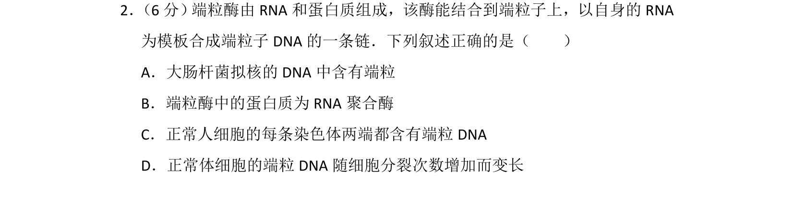
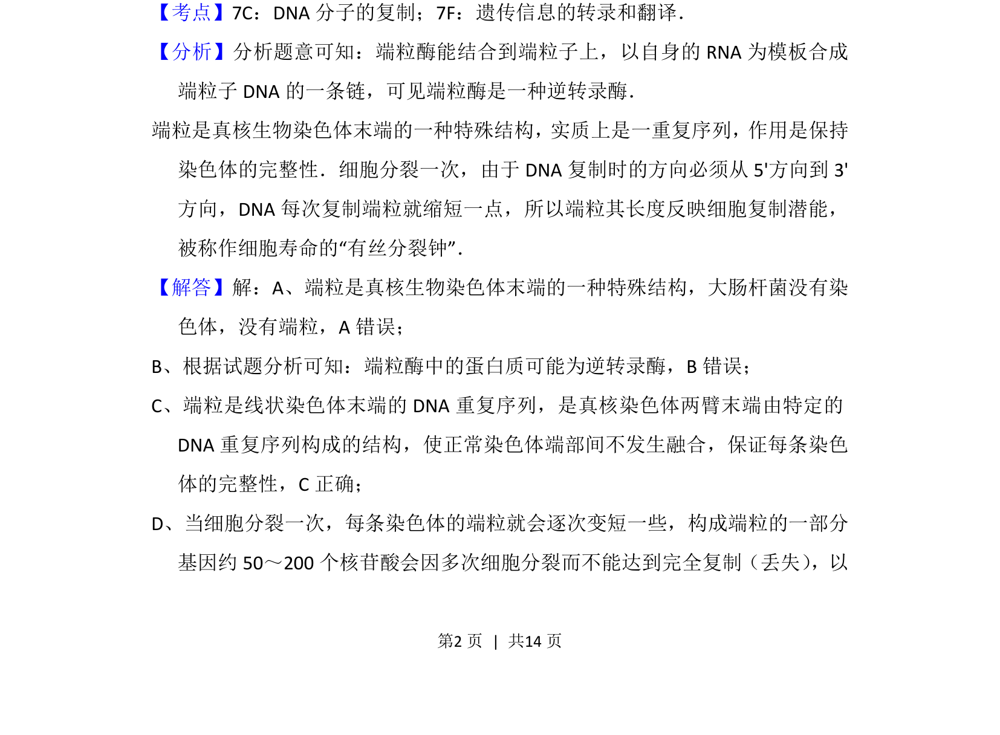
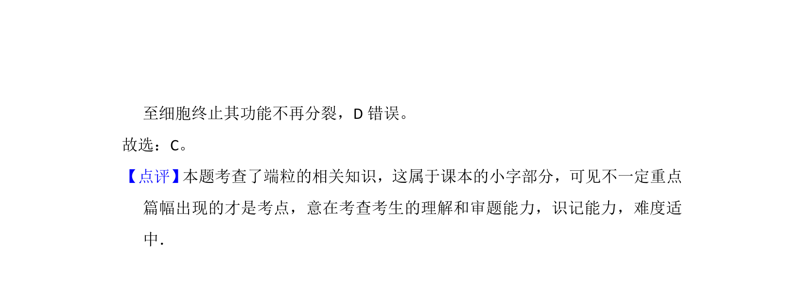

## 题面

## 摘要

端粒酶的结构与功能，端粒在染色体末端的作用

## 关联考点

- [[671-端粒|端粒]]
- [[796-端粒酶|端粒酶]]
- [[513-逆转录|逆转录]]
- [[200-染色体|染色体]]

## 答案与解析

> 📄 原 PDF 第 2 页：`素材/真题/吉林/2008-2024·（吉林）生物高考真题/2015年高考生物试卷（新课标Ⅱ）（解析卷）.pdf`

<!-- 题干文本-start -->
## 题干文本
2． （6分） 端粒酶由RNA和蛋白质组成，该酶能结合到端粒子上，以自身的RNA
为模板合成端粒子DNA的一条链．下列叙述正确的是（　　）
A．大肠杆菌拟核的DNA中含有端粒
B．端粒酶中的蛋白质为RNA聚合酶
C．正常人细胞的每条染色体两端都含有端粒DNA
D．正常体细胞的端粒DNA随细胞分裂次数增加而变长
<!-- 题干文本-end -->

<!-- 解析文本-start -->
## 解析文本
【考点】7C：DNA分子的复制；7F：遗传信息的转录和翻译．菁优网版权所有
【分析】分析题意可知：端粒酶能结合到端粒子上，以自身的RNA为模板合成
端粒子DNA的一条链，可见端粒酶是一种逆转录酶．
端粒是真核生物染色体末端的一种特殊结构，实质上是一重复序列，作用是保持
染色体的完整性．细胞分裂一次，由于DNA复制时的方向必须从5'方向到3'
方向，DNA每次复制端粒就缩短一点，所以端粒其长度反映细胞复制潜能，
被称作细胞寿命的“有丝分裂钟”．
【解答】解：A、端粒是真核生物染色体末端的一种特殊结构，大肠杆菌没有染
色体，没有端粒，A错误；
B、根据试题分析可知：端粒酶中的蛋白质可能为逆转录酶，B错误；
C、端粒是线状染色体末端的DNA重复序列，是真核染色体两臂末端由特定的
DNA重复序列构成的结构，使正常染色体端部间不发生融合，保证每条染色
体的完整性，C正确；
D、当细胞分裂一次，每条染色体的端粒就会逐次变短一些，构成端粒的一部分
基因约50～200个核苷酸会因多次细胞分裂而不能达到完全复制（丢失） ，以
<!-- 解析文本-end -->
