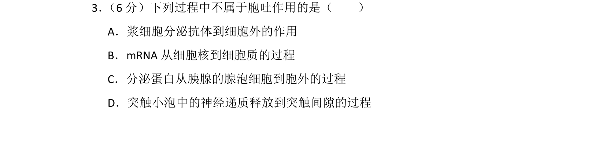
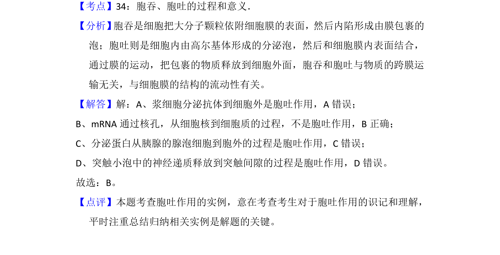

## 题面

## 摘要

本题考查胞吐作用的实例辨析及物质运输方式判断

## 关联考点

- [[260-胞吞|胞吞]]
- [[259-胞吐|胞吐]]
- [[636-物质运输|物质运输]]

## 答案与解析

> 📄 原 PDF 第 3 页：`素材/真题/吉林/2008-2024·（吉林）生物高考真题/2015年高考生物试卷（新课标Ⅱ）（解析卷）.pdf`

<!-- 题干文本-start -->
## 题干文本
3． （6分）下列过程中不属于胞吐作用的是（　　）
A．浆细胞分泌抗体到细胞外的作用
B．mRNA从细胞核到细胞质的过程
C．分泌蛋白从胰腺的腺泡细胞到胞外的过程
D．突触小泡中的神经递质释放到突触间隙的过程
<!-- 题干文本-end -->

<!-- 解析文本-start -->
## 解析文本
【考点】34：胞吞、胞吐的过程和意义．菁优网版权所有
【分析】 胞吞是细胞把大分子颗粒依附细胞膜的表面，然后内陷形成由膜包裹的
泡；胞吐则是细胞内由高尔基体形成的分泌泡，然后和细胞膜内表面结合，
通过膜的运动，把包裹的物质释放到细胞外面，胞吞和胞吐与物质的跨膜运
输无关，与细胞膜的结构的流动性有关。
【解答】解：A、浆细胞分泌抗体到细胞外是胞吐作用，A错误；
B、mRNA通过核孔，从细胞核到细胞质的过程，不是胞吐作用，B正确；
C、分泌蛋白从胰腺的腺泡细胞到胞外的过程是胞吐作用，C错误；
D、突触小泡中的神经递质释放到突触间隙的过程是胞吐作用，D错误。
故选：B。
【点评】本题考查胞吐作用的实例，意在考查考生对于胞吐作用的识记和理解，
平时注重总结归纳相关实例是解题的关键。
<!-- 解析文本-end -->
