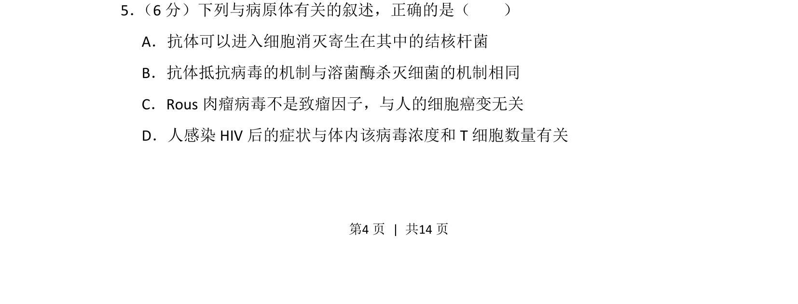
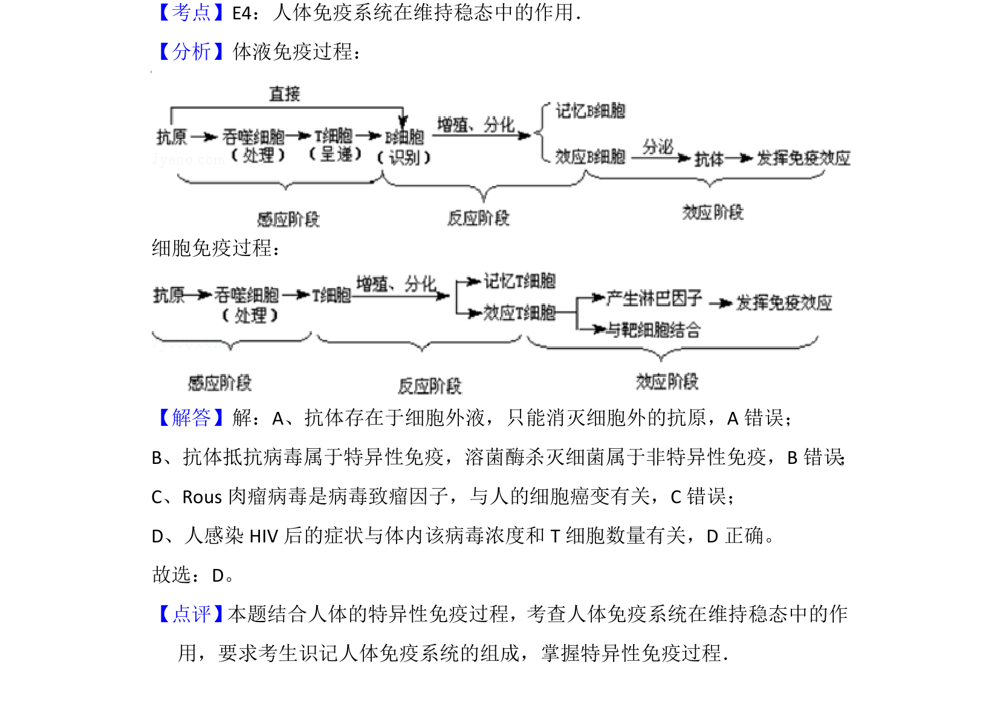

## 题面

## 摘要

该题考查免疫调节、病毒致癌及 HIV 致病机理等病原体相关生物学知识。

## 关联考点

- [[156-免疫|免疫调节]]
- [[504-病毒致癌因子|病毒致癌因子]]
- [[526-HIV 致病机制|HIV 致病机制]]

## 答案与解析

> 📄 原 PDF 第 4 页：`素材/真题/吉林/2008-2024·（吉林）生物高考真题/2015年高考生物试卷（新课标Ⅱ）（解析卷）.pdf`

<!-- 题干文本-start -->
## 题干文本
5． （6分）下列与病原体有关的叙述，正确的是（　　）
A．抗体可以进入细胞消灭寄生在其中的结核杆菌
B．抗体抵抗病毒的机制与溶菌酶杀灭细菌的机制相同
C．Rous肉瘤病毒不是致瘤因子，与人的细胞癌变无关
D．人感染HIV后的症状与体内该病毒浓度和T细胞数量有关
<!-- 题干文本-end -->

<!-- 解析文本-start -->
## 解析文本

<!-- 解析文本-end -->
