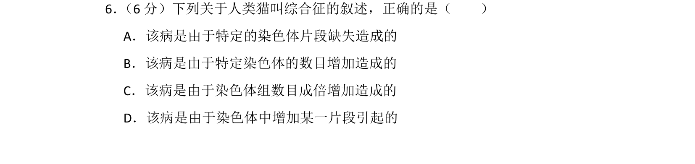
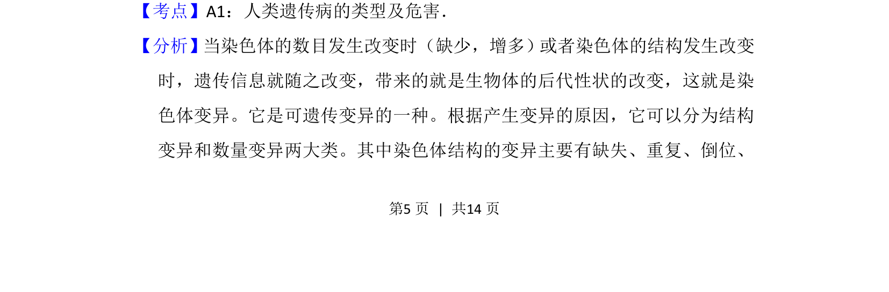
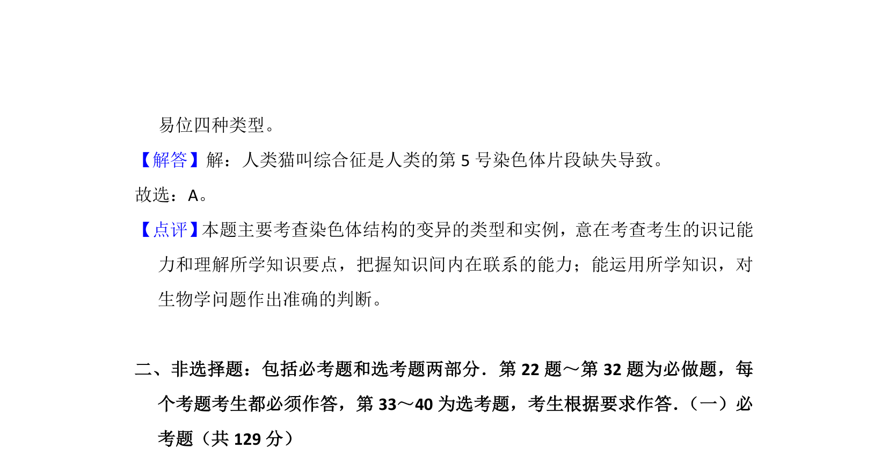

## 题面

## 摘要

该题考查人类遗传病类型及染色体变异相关知识。

## 关联考点

- [[299-人类遗传病|人类遗传病]]
- [[306-染色体结构变异|染色体结构变异]]
- [[305-染色体数目变异|染色体数目变异]]

## 答案与解析

> 📄 原 PDF 第 5 页：`素材/真题/吉林/2008-2024·（吉林）生物高考真题/2015年高考生物试卷（新课标Ⅱ）（解析卷）.pdf`
