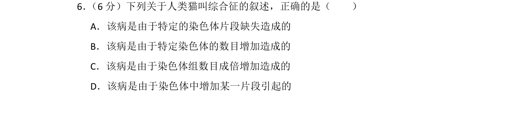
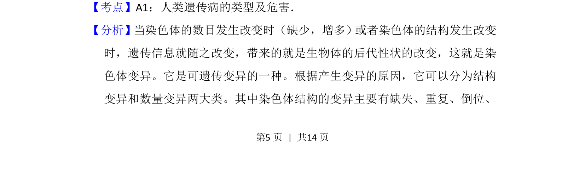
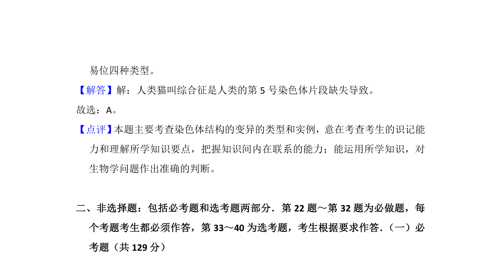

## 题面

## 摘要

该题考查人类遗传病类型及染色体变异相关知识。

## 关联考点

- [[299-人类遗传病|人类遗传病]]
- [[306-染色体结构变异|染色体结构变异]]
- [[305-染色体数目变异|染色体数目变异]]

## 答案与解析

> 📄 原 PDF 第 5 页：`素材/真题/吉林/2008-2024·（吉林）生物高考真题/2015年高考生物试卷（新课标Ⅱ）（解析卷）.pdf`

<!-- 题干文本-start -->
## 题干文本
6． （6分）下列关于人类猫叫综合征的叙述，正确的是（　　）
A．该病是由于特定的染色体片段缺失造成的
B．该病是由于特定染色体的数目增加造成的
C．该病是由于染色体组数目成倍增加造成的
D．该病是由于染色体中增加某一片段引起的
<!-- 题干文本-end -->

<!-- 解析文本-start -->
## 解析文本
【考点】A1：人类遗传病的类型及危害．菁优网版权所有
【分析】当染色体的数目发生改变时（缺少，增多）或者染色体的结构发生改变
时，遗传信息就随之改变，带来的就是生物体的后代性状的改变，这就是染
色体变异。它是可遗传变异的一种。根据产生变异的原因，它可以分为结构
变异和数量变异两大类。其中染色体结构的变异主要有缺失、重复、倒位、
<!-- 解析文本-end -->
