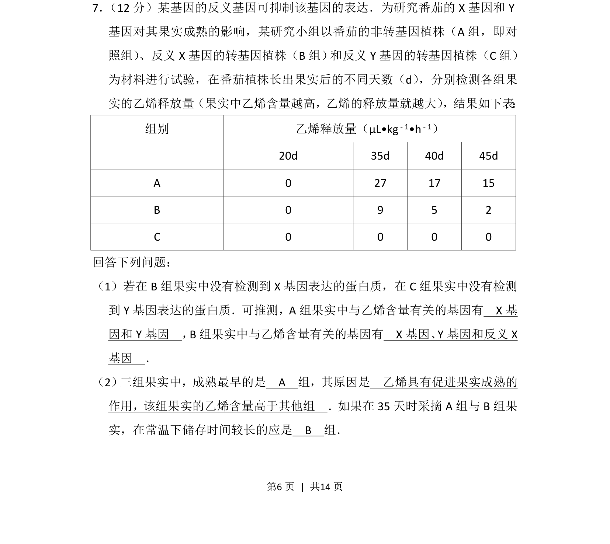
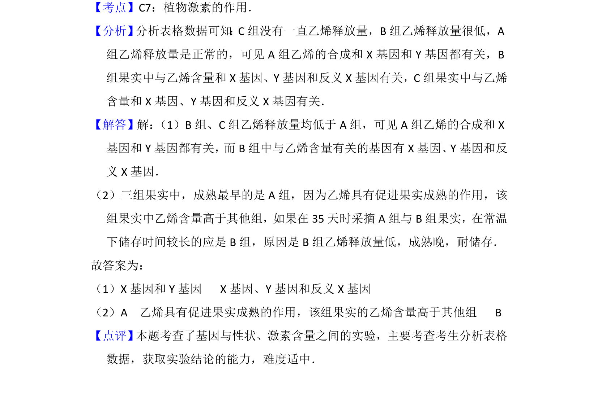

## 题面

## 摘要

研究反义基因抑制X或Y基因对番茄乙烯释放及果实成熟影响的实验分析

## 关联考点

- [[479-基因表达|基因表达]]
- [[564-反义基因|反义基因]]
- [[537-乙烯生理作用|乙烯生理作用]]
- [[751-对照组实验|对照组实验]]

## 答案与解析

> 📄 原 PDF 第 6 页：`素材/真题/吉林/2008-2024·（吉林）生物高考真题/2015年高考生物试卷（新课标Ⅱ）（解析卷）.pdf`
