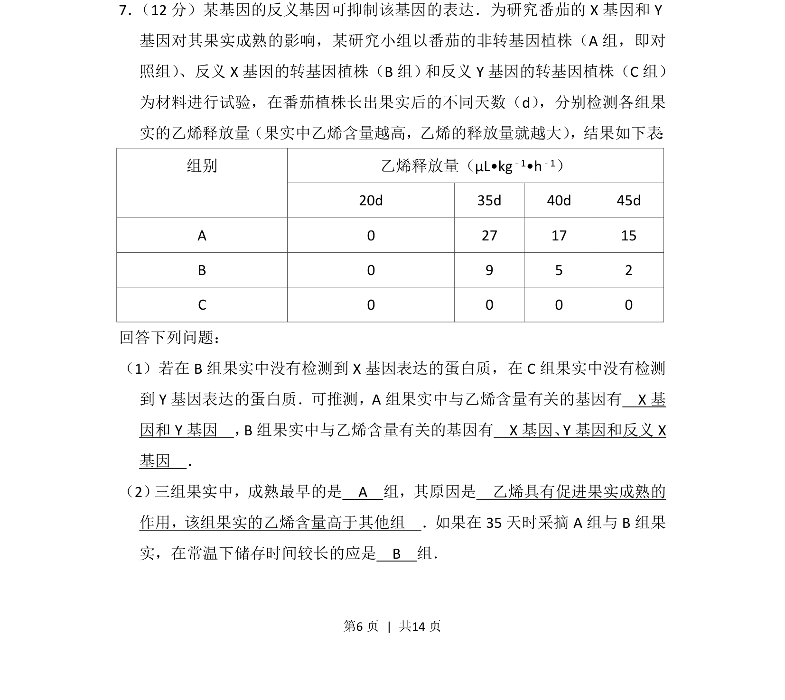
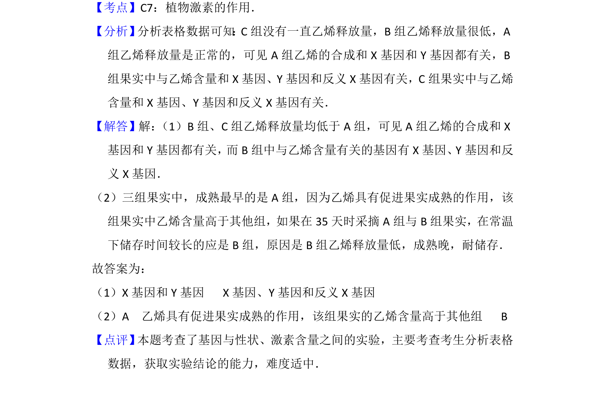

## 题面

## 摘要

研究反义基因抑制X或Y基因对番茄乙烯释放及果实成熟影响的实验分析

## 关联考点

- [[843-基因的表达|基因表达]]
- [[564-反义基因|反义基因]]
- [[537-乙烯生理作用|乙烯生理作用]]
- [[751-对照组实验|对照组实验]]

## 答案与解析

> 📄 原 PDF 第 6 页：`素材/真题/吉林/2008-2024·（吉林）生物高考真题/2015年高考生物试卷（新课标Ⅱ）（解析卷）.pdf`

<!-- 题干文本-start -->
## 题干文本
7． （12分）某基因的反义基因可抑制该基因的表达．为研究番茄的X基因和Y
基因对其果实成熟的影响，某研究小组以番茄的非转基因植株（A组，即对
照组） 、反义X基因的转基因植株（B组） 和反义Y基因的转基因植株（C组）
为材料进行试验，在番茄植株长出果实后的不同天数（d） ，分别检测各组果
实的乙烯释放量（果实中乙烯含量越高，乙烯的释放量就越大） ，结果如下表 ：
乙烯释放量（μL•kg﹣1•h﹣1）组别
20d 35d 40d 45d
A 0 27 17 15
B 0 9 5 2
C 0 0 0 0
回答下列问题：
（1）若在B组果实中没有检测到X基因表达的蛋白质，在C组果实中没有检测
到Y基因表达的蛋白质．可推测，A组果实中与乙烯含量有关的基因有　X基
因和Y基因　，B组果实中与乙烯含量有关的基因有　X基因、Y基因和反义X
基因　．
（2） 三组果实中，成熟最早的是　A　组，其原因是　乙烯具有促进果实成熟的
作用，该组果实的乙烯含量高于其他组　．如果在35天时采摘A组与B组果
实，在常温下储存时间较长的应是　B　组．
<!-- 题干文本-end -->

<!-- 解析文本-start -->
## 解析文本

<!-- 解析文本-end -->
